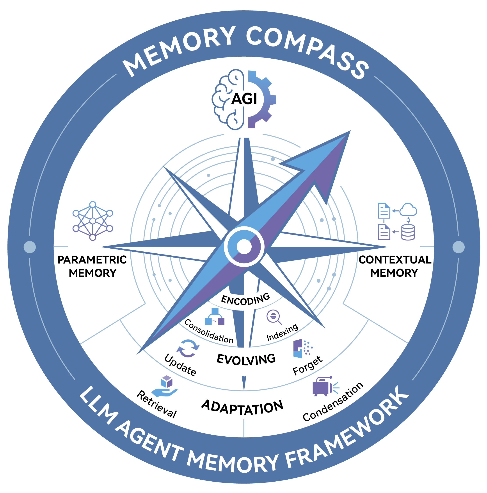
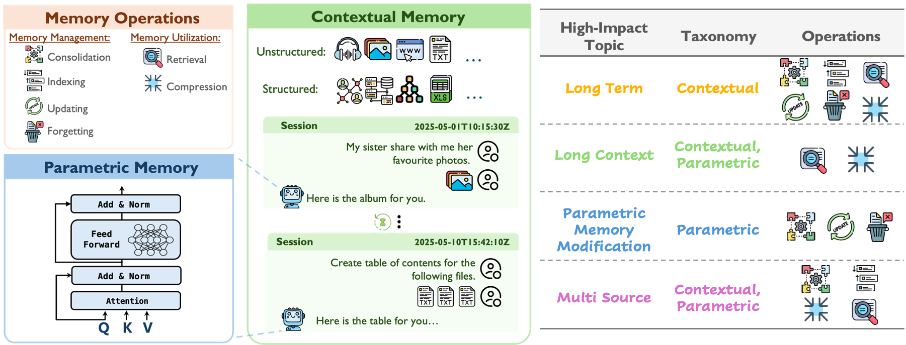
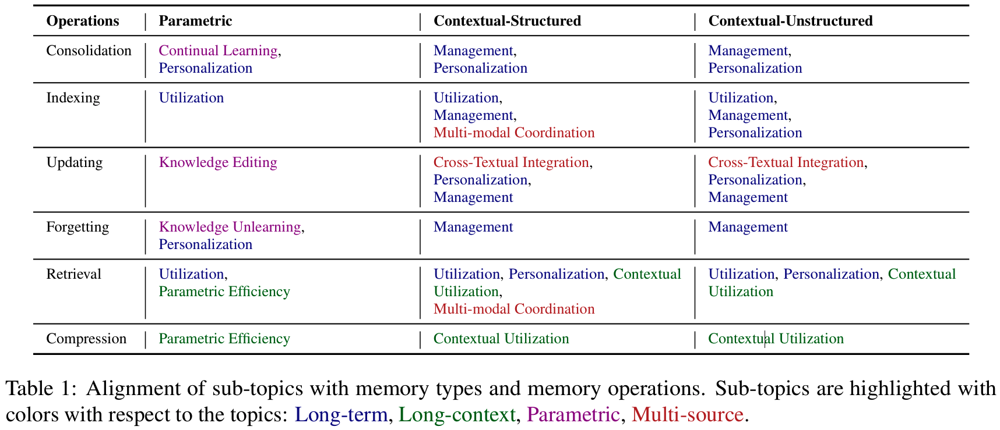

<h1 align="center">Memory Compass</h1>


<div align="center">
  
</div>

<div align="center">
  <h3>Rethinking Memory in AI: Taxonomy, Operations, Topics, and Future Directions</h3>

  <p align="center">
    <a href="https://arxiv.org/abs/2505.00675">📝 Paper</a> | <a href="#1-Survey-Papers">📄 List</a> | <a href="">📚 Notions</a>
  </p>
</div>

<div align="center">

[](https://github.com/Elvin-Yiming-Du/Survey_Memory_in_AI/blob/main/LICENSE)

<!--  -->

[](https://github.com/Elvin-Yiming-Du/Survey_Memory_in_AI/commits/main)
[](https://github.com/Xnhyacinth/Long_Text_Modeling_Papers/pulls)
[](https://github.com/Elvin-Yiming-Du/Survey_Memory_in_AI)

</div>

This repository introduce a comprehensive paper list, datasets, methods and tools for memory research.

## Contents

- [Rethinking Memory in AI: Taxonomy, Operations, Topics, and Future Directions](#rethinking-memory-in-ai-taxonomy-operations-topics-and-future-directions)
  - [Contents](#contents)
    - [Memory Taxonomy](#memory-taxonomy)
    - [Memory Operations](#memory-operations)
  - [📢 News](#-news)
    - [Week Papers](#week-papers)
  - [📜 Papers](#-papers)
    - [1. Survey Papers](#1-survey-papers)
    - [2. Memory Topics](#2-memory-topics)
      - [2.1 Long Term Memory](#21-long-term-memory)
      - [2.2 Long Context Memory](#22-long-context-memory)
      - [2.3 Parametric Memory](#23-parametric-memory)
      - [2.4 Multi-source Memory](#24-multi-source-memory)
  - [📊 Datasets](#-datasets)
    - [Evaluation for Long Term Memroy.](#evaluation-for-long-term-memroy)
    - [Evaluation for Long Context Memory](#evaluation-for-long-context-memory)
    - [Paramatric Memory Modification](#paramatric-memory-modification)
    - [Evaluation for Multi-Source Memory](#evaluation-for-multi-source-memory)
  - [🧠 Methods](#-methods)
  - [⚙️ Tools](#️-tools)
    - [Components Level](#components-level)
    - [Framework Level](#framework-level)
    - [Application-Layer Level](#application-layer-level)
    - [Product Level](#product-level)
  - [🆚 Human vs. AI in Memory](#-human_vs._ai_in_memory)
  - [🌞 Future Directions](#-future-directions)
  - [Acknowledgements](#acknowledgements)
    - [Contributors](#contributors)
    - [Star History](#star-history)

## 📢 News
- 🚀 **[Memory-T1](https://arxiv.org/abs/2512.20092 ) Released!** We propose a new RL method designed for **temporal reasoning and long-term memory** in large language models.  
Memory-T1 focuses on multi-session interactions and realistic temporal dependencies, enabling systematic evaluation of memory-aware agents.
- [Version 3](https://arxiv.org/abs/2505.00675) is availabel!
- [Paper List](#-papers), [benchmarks](#-datasets) and [tools](#-tools) has been udpated.
- [Version 2](https://arxiv.org/abs/2505.00675) of our work is now available.

### Memory Taxonomy




## 📜 Papers

### 1. Survey Papers

#### 2025
- [**Memory in the Age of AI Agents**](https://arxiv.org/abs/2512.13564) _Yuyang Hu, Shichun Liu, Yanwei Yue, Guibin Zhang, Boyang Liu, Fangyi Zhu, Jiahang Lin, Honglin Guo, Shihan Dou, Zhiheng Xi, Senjie Jin, Jiejun Tan, Yanbin Yin, Jiongnan Liu, Zeyu Zhang, Zhongxiang Sun, Yutao Zhu, Hao Sun, Boci Peng, Zhenrong Cheng, Xuanbo Fan, Jiaxin Guo, Xinlei Yu, Zhenhong Zhou, Zewen Hu, Jiahao Huo, Junhao Wang, Yuwei Niu, Yu Wang, Zhenfei Yin, Xiaobin Hu, Yue Liao, Qiankun Li, Kun Wang, Wangchunshu Zhou, Yixin Liu, Dawei Cheng, Qi Zhang, Tao Gui, Shirui Pan, Yan Zhang, Philip Torr, Zhicheng Dou, Ji-Rong Wen, Xuanjing Huang, Yu-Gang Jiang, Shuicheng Yan._ Arxiv 2025.

- [**A Comprehensive Survey of Machine Unlearning Techniques for Large Language Models**](https://www.arxiv.org/abs/2503.01854) _Jiahui Geng, Qing Li, Herbert Woisetschlaeger, Zongxiong Chen, Yuxia Wang, Preslav Nakov, Hans-Arno Jacobsen, Fakhri Karray._ Arxiv 2025.

- [**A Comprehensive Survey on Long Context Language Modeling**](https://arxiv.org/abs/2503.17407) _Jiaheng Liu, Dawei Zhu, Zhiqi Bai, Yancheng He, Huanxuan Liao, Haoran Que, Zekun Wang, Chenchen Zhang, Ge Zhang, Jiebin Zhang, Yuanxing Zhang, Zhuo Chen, Hangyu Guo, Shilong Li, Ziqiang Liu, Yong Shan, Yifan Song, Jiayi Tian, Wenhao Wu, Zhejian Zhou, Ruijie Zhu, Junlan Feng, Yang Gao, Shizhu He, Zhoujun Li, Tianyu Liu, Fanyu Meng, Wenbo Su, Yingshui Tan, Zili Wang, Jian Yang, Wei Ye, Bo Zheng, Wangchunshu Zhou, Wenhao Huang, Sujian Li, Zhaoxiang Zhang_ Arxiv 2025.

- [**A Survey of Personalized Large Language Models: Progress and Future Directions**](https://arxiv.org/abs/2502.11528) _Jiahong Liu, Zexuan Qiu, Zhongyang Li, Quanyu Dai, Jieming Zhu, Minda Hu, Menglin Yang, Irwin King._ Arxiv 2025.

- [**Prompt Compression for Large Language Models: A Survey**](https://aclanthology.org/2025.naacl-long.368/) _Zongqian Li, Yinhong Liu, Yixuan Su, Nigel Collier_ NAACL 2025.

- [**Cognitive Memory in Large Language Models**](https://arxiv.org/abs/2504.02441) _Lianlei Shan, Shixian Luo, Zezhou Zhu, Yu Yuan, Yong Wu._ Arxiv 2025.

- [**Human-inspired Perspectives: A Survey on AI Long-term Memory**](https://arxiv.org/abs/2411.00489) _Zihong He, Weizhe Lin, Hao Zheng, Fan Zhang, Matt W. Jones, Laurence Aitchison, Xuhai Xu, Miao Liu, Per Ola Kristensson, Junxiao Shen._ Arxiv 2025.

#### 2024

- [**Knowledge Conflicts for LLMs: A Survey**](https://aclanthology.org/2024.emnlp-main.486/) _Rongwu Xu, Zehan Qi, Zhijiang Guo, Cunxiang Wang, Hongru Wang, Yue Zhang, Wei Xu._ EMNLP 2024.

- [**A Survey on the Memory Mechanism of Large Language Model based Agents.**](https://arxiv.org/abs/2404.13501) _Zhang, Zeyu and Bo, Xiaohe and Ma, Chen and Li, Rui and Chen, Xu and Dai, Quanyu and Zhu, Jieming and Dong, Zhenhua and Wen, Ji-Rong._ Arxiv 2024.

- [**Knowledge Editing for Large Language Models: A Survey**](https://arxiv.org/abs/2310.16218) _Song Wang, Yaochen Zhu, Haochen Liu, Zaiyi Zheng, Chen Chen, Jundong Li._ Arxiv 2024.

- [**Advancing Transformer Architecture in Long-Context Large Language Models: A Comprehensive Survey**](https://arxiv.org/abs/2311.12351) _Yunpeng Huang, Jingwei Xu, Junyu Lai, Zixu Jiang, Taolue Chen, Zenan Li, Yuan Yao, Xiaoxing Ma, Lijuan Yang, Hao Chen, Shupeng Li, Penghao Zhao._ Arxiv 2024.

### 2. Memory Topics

#### 2.1 Long Term Memory

##### 2025
- [**PersonaMem-v2: Towards Personalized Intelligence via Learning Implicit User Personas and Agentic Memory**](https://www.arxiv.org/abs/2512.06688) _Bowen Jiang, Yuan Yuan, Maohao Shen, Zhuoqun Hao, Zhangchen Xu, Zichen Chen, Zijun Liu, Anirudh Ravi Vijjini, Jiaming He, and others._ Arxiv 2025.
- [**O-Mem: Omni Memory System for Personalized, Long Horizon, Self-Evolving Agents**](https://arxiv.org/abs/2511.13593) _Piaohong Wang, Motong Tian, Jiaxian Li, Yuan Liang, Yuqing Wang, Qianben Chen, Tiannan Wang, Zhicong Lu, Jiawei Ma, Yuchen Eleanor Jiang, Wangchunshu Zhou._ Arxiv 2025.
- [**MemoryBench: A Benchmark for Memory and Continual Learning in LLM Systems**](https://arxiv.org/abs/2510.17281) _Yifan Song, Weimin Xiong, Dawei Zhu, Cheng Li, Ke Wang, and others._ Arxiv 2025.
- [**Agent Learning via Early Experience**](https://arxiv.org/abs/2510.08558) _Kai Zhang, Xiangchao Chen, Bo Liu, Tianci Xue, Zeyi Liao, Zhihan Liu, Xiyao Wang, Yuting Ning, Zhaorun Chen, Xiaohan Fu, and others._ Arxiv 2025.
- [**G-Memory: Tracing Hierarchical Memory for Multi-Agent Systems**](https://arxiv.org/abs/2506.07398) _Guibin Zhang, Muxin Fu, Guancheng Wan, Miao Yu, Kun Wang, Shuicheng Yan._ Arxiv 2025.
- [**HaluMem: Evaluating Hallucinations in Memory Systems of Agents**](https://arxiv.org/abs/2511.03506) _Ding Chen, Simin Niu, Kehang Li, Peng Liu, Xiangping Zheng, Bo Tang, Xinchi Li, Feiyu Xiong, Zhiyu Li._ Arxiv 2025.
- [**MemAgent: Reshaping Long-Context LLM with Multi-Conv RL-based Memory Agent**](https://arxiv.org/abs/2507.02259) _Hongli Yu, Tinghong Chen, Jiangtao Feng, Jiangjie Chen, Weinan Dai, Qiying Yu, Ya-Qin Zhang, Wei-Ying Ma, Jingjing Liu, Mingxuan Wang, and others._ Arxiv 2025.
- [**Evaluating Memory in LLM Agents via Incremental Multi-Turn Interactions**](https://arxiv.org/abs/2507.05257) _Yuanzhe Hu, Yu Wang, Julian McAuley._ Arxiv 2025.
- [**Mem0: Building production-ready ai agents with scalable long-term memory**](https://arxiv.org/abs/2504.19413) _Prateek Chhikara, Dev Khant, Saket Aryan, Taranjeet Singh, Deshraj Yadav._ Arxiv 2025.
- [**MemOS: An Operating System for Memory-Augmented Generation (MAG) in Large Language Models**](https://arxiv.org/abs/2505.22101) _Zhiyu Li, Shichao Song, Hanyu Wang, Simin Niu, Ding Chen, Jiawei Yang, Chenyang Xi, Huayi Lai, Jihao Zhao, Yezhaohui Wang, and others._ Arxiv 2025.
- [**LightMem: Lightweight and Efficient Memory-Augmented Generation**](https://arxiv.org/abs/2510.18866) _Qingyang Zhang, Ningyu Zhang, and others._ Arxiv 2025.
- [**Memory OS of AI Agent**](https://arxiv.org/abs/2506.06326) _Jiazheng Kang, Mingming Ji, Zhe Zhao, Ting Bai._ Arxiv 2025.
- [**MemU: An open-source memory framework for AI companions**](https://github.com/NevaMind-AI/memU) _NevaMind-AI._ GitHub 2025.
- [**Hierarchical Memory for High-Efficiency Long-Term Reasoning in LLM Agents**](https://arxiv.org/abs/2507.22925) _Haoran Sun, Shaoning Zeng._ Arxiv 2025.
- [**ReasoningBank: Scaling Agent Self-Evolving with Reasoning Memory**](https://arxiv.org/abs/2509.25140) _Siru Ouyang, Jun Yan, I-Hung Hsu, Yanfei Chen, Ke Jiang, Zifeng Wang, Rujun Han, Long T. Le, Samira Daruki, Xiangru Tang, Vishy Tirumalashetty, George Lee, Mahsan Rofouei, Hangfei Lin, Jiawei Han, Chen-Yu Lee, Tomas Pfister._ Arxiv 2025.
- [**Agentic Context Engineering: Evolving Contexts for Self-Improving Language Models**](https://arxiv.org/abs/2510.04618) _Qizheng Zhang, Changran Hu, Shubhangi Upasani, Boyuan Ma, Fenglu Hong, Vamsidhar Kamanuru, Jay Rainton, Chen Wu, Mengmeng Ji, Hanchen Li, Urmish Thakker, James Zou, Kunle Olukotun._ Arxiv 2025.
- [**Coarse-to-Fine Grounded Memory for LLM Agent Planning**](https://arxiv.org/abs/2508.15305) _Wei Yang, Jinwei Xiao, Hongming Zhang, Qingyang Zhang, Yanna Wang, Bo Xu._ Arxiv 2025.
- [**Chain-of-Memory: Enhancing GUI Agents for Cross-Application Navigation**](https://arxiv.org/abs/2506.18158) _Xinzge Gao, Chuanrui Hu, Bin Chen, Teng Li._ Arxiv 2025.
- [**MEM1: Learning to Synergize Memory and Reasoning for Efficient Long-Horizon Agents**](https://arxiv.org/abs/2506.15841) _Zijian Zhou, Ao Qu, Zhaoxuan Wu, Sunghwan Kim, Alok Prakash, Daniela Rus, Jinhua Zhao, Bryan Kian Hsiang Low, Paul Pu Liang._ Arxiv 2025.
- [**Tremu: Towards Neuro-Symbolic Temporal Reasoning for LLM-Agents with Memory in Multi-Session Dialogues**](https://arxiv.org/abs/2502.01630) _Yubin Ge, Salvatore Romeo, Jason Cai, Raphael Shu, Monica Sunkara, Yassine Benajiba, Yi Zhang._ Arxiv 2025.
- [**Emergence of Episodic Memory in Transformers: Characterizing Changes in Temporal Structure of Attention Scores During Training**](https://arxiv.org/abs/2502.06902) _Deven Mahesh Mistry, Anooshka Bajaj, Yash Aggarwal, Sahaj Singh Maini, Zoran Tiganj._ Arxiv 2025.
- [**Concept-Reversed Winograd Schema Challenge: Evaluating and Improving Robust Reasoning in Large Language Models via Abstraction**]() _Kaiqiao Han, Tianqing Fang, Zhaowei Wang, Yangqiu Song, Mark Steedman._ NAACL 2025.
- [**Learn to Memorize: Optimizing LLM-based Agents with Adaptive Memory Framework**](https://arxiv.org/abs/2508.16629) _Zeyu Zhang, Quanyu Dai, Rui Li, Xiaohe Bo, Xu Chen, Zhenhua Dong._ Arxiv 2025.
- [**Memory-R1: Enhancing large language model agents to manage and utilize memories via reinforcement learning**](https://arxiv.org/abs/2508.19828) _Sikuan Yan, Xiufeng Yang, Zuchao Huang, Ercong Nie, Zifeng Ding, Zonggen Li, Xiaowen Ma, Hinrich Schütze, Volker Tresp, Yunpu Ma._ Arxiv 2025.
- [**Mem-$\alpha$: Learning Memory Construction via Reinforcement Learning**](https://arxiv.org/abs/2509.25911) _Yu Wang, Ryuichi Takanobu, Zhiqi Liang, Yuzhen Mao, Yuanzhe Hu, Julian McAuley, Xiaojian Wu._ Arxiv 2025.
- [**AgentFly: Fine-tuning LLM Agents without Fine-tuning LLMs**](https://arxiv.org/abs/2508.16153) _Huichi Zhou, Yihang Chen, Siyuan Guo, Xue Yan, Kin Hei Lee, Zihan Wang, Ka Yiu Lee, Guchun Zhang, Kun Shao, Linyi Yang, and others._ Arxiv 2025.
- [**MemAgent: Reshaping Long-Context LLM with Multi-Conv RL-based Memory Agent**](https://arxiv.org/abs/2507.02259) _Hongli Yu, Tinghong Chen, Jiangtao Feng, Jiangjie Chen, Weinan Dai, Qiying Yu, Ya-Qin Zhang, Wei-Ying Ma, Jingjing Liu, Mingxuan Wang, and others._ Arxiv 2025.
- [**Evaluating Memory in LLM Agents via Incremental Multi-Turn Interactions**](https://arxiv.org/abs/2507.05257) _Yuanzhe Hu, Yu Wang, Julian McAuley._ Arxiv 2025.
- [**MemBench: Towards More Comprehensive Evaluation on the Memory of LLM-based Agents**](https://arxiv.org/abs/2506.21605) _Haoran Tan, Zeyu Zhang, Chen Ma, Xu Chen, Quanyu Dai, Zhenhua Dong._ Arxiv 2025.
- [**MemGuide: Intent-Driven Memory Selection for Goal-Oriented Multi-Session LLM Agents**](https://arxiv.org/abs/2505.20231) _Yiming Du, Bingbing Wang, Yang He, Bin Liang, Baojun Wang, Zhongyang Li, Lin Gui, Jeff Z. Pan, Ruifeng Xu, Kam-Fai Wong._ Arxiv 2025.
- [**MemTool: Optimizing Short-Term Memory Management for Dynamic Tool Calling in LLM Agent Multi-Turn Conversations**](https://arxiv.org/abs/2507.21428) _Elias Lumer, Anmol Gulati, Vamse Kumar Subbiah, Pradeep Honaganahalli Basavaraju, James A Burke._ Arxiv 2025.
- [**Memp: Exploring Agent Procedural Memory**](https://arxiv.org/abs/2508.06433) _Runnan Fang, Yuan Liang, Xiaobin Wang, Jialong Wu, Shuofei Qiao, Pengjun Xie, Fei Huang, Huajun Chen, Ningyu Zhang._ Arxiv 2025.

- [**LongMemEval: Benchmarking Chat Assistants on Long-Term Interactive Memory**](https://arxiv.org/abs/2410.10813) _Di Wu, Hongwei Wang, Wenhao Yu, Yuwei Zhang, Kai-Wei Chang, Dong Yu._ ICLR 2025.

- [**Compress to Impress: Unleashing the Potential of Compressive Memory in Real-World Long-Term Conversations**](https://aclanthology.org/2025.coling-main.51.pdf) _Nuo Chen, Hongguang Li, Jia Li, Yuxuan Li, Wei Wu._ COLING 2025.

- [**Towards Lifelong Dialogue Agents via Timeline-based Memory Management**](https://aclanthology.org/2025.naacl-long.435/) _Kai Tzu-iunn Ong, Namyoung Kim, Minju Gwak, Hyungjoo Chae, Taeyoon Kwon, Yohan Jo, Seung-won Hwang, Dongha Lee, Jinyoung Yeo._ NAACL 2025.

- [**Zep: A Temporal Knowledge Graph Architecture for Agent Memory**](https://arxiv.org/abs/2501.13956) _Preston Rasmussen, Daniel Chalef._ Arxiv 2025.

- [**From RAG to Memory: Non-Parametric Continual Learning for Large Language Models**](https://arxiv.org/abs/2502.14802) _Bernal Jiménez Gutiérrez, Yiheng Shu, Weijian Qi, Sizhe Zhou, Yu Su._ ICML 2025.

- [**Disentangling Memory and Reasoning Ability in Large Language Models**](https://arxiv.org/abs/2411.13504) _Mingyu Jin, Weidi Luo, Sitao Cheng, Xinyi Wang, Wenyue Hua, Ruixiang Tang, William Yang Wang, Yongfeng Zhang._ Arxiv 2025.

- [**MemoRAG: Boosting Long Context Processing with Global Memory-Enhanced Retrieval Augmentation**](https://arxiv.org/abs/2409.05591) _Hongjin Qian, Zheng Liu, Peitian Zhang, Kelong Mao, Defu Lian, Zhicheng Dou, Tiejun Huang._ Arxiv 2025.

- [**Hello Again! LLM-powered Personalized Agent for Long-term Dialogue**](https://aclanthology.org/2025.naacl-long.272.pdf) _Hao Li, Chenghao Yang, An Zhang, Yang Deng, Xiang Wang, Tat-Seng Chua._ NAACL 2025. 

- [**MemInsight: Autonomous Memory Augmentation for LLM Agents**](https://arxiv.org/html/2503.21760v1) _Rana Salama, Jason Cai, Michelle Yuan, Anna Currey, Monica Sunkara, Yi Zhang, Yassine Benajiba._ Arxiv 2025.

- [**Interpersonal Memory Matters: A New Task for Proactive Dialogue Utilizing Conversational History**](https://arxiv.org/abs/2503.05150) _Bowen Wu, Wenqing Wang, Haoran Li, Ying Li, Jingsong Yu, Baoxun Wang._ Arxiv 2025. 

- [**Echo: A Large Language Model with Temporal Episodic Memory**](https://arxiv.org/abs/2502.16090) _WenTao Liu, Ruohua Zhang, Aimin Zhou, Feng Gao, JiaLi Liu._ Arxiv 2025.

- [**Improving Factuality with Explicit Working Memory**](https://arxiv.org/abs/2412.18069) _Mingda Chen, Yang Li, Karthik Padthe, Rulin Shao, Alicia Sun, Luke Zettlemoyer, Gargi Ghosh, Wen-tau Yih._ Arxiv 2025.

- [**Memorization Over Reasoning? Exposing and Mitigating Verbatim Memorization in Large Language Models' Character Understanding Evaluation**](https://arxiv.org/abs/2412.14368) _Yuxuan Jiang, Francis Ferraro._ Arxiv 2025.

- [**Self-Memory Alignment: Mitigating Factual Hallucinations with Generalized Improvement**](https://arxiv.org/abs/2502.19127) _Siyuan Zhang, Yichi Zhang, Yinpeng Dong, Hang Su._ Arxiv 2025.

- [**Needle in the Haystack for Memory Based Large Language Models**](https://icml.cc/virtual/2024/36123) _Elliot Nelson, Georgios Kollias, Payel Das, Subhajit Chaudhury, Soham Dan._ ICLR 2025.

##### 2024

- [**Evaluating Very Long-Term Conversational Memory of LLM Agents**](https://aclanthology.org/2024.acl-long.747.pdf) _Adyasha Maharana, Dong-Ho Lee, Sergey Tulyakov, Mohit Bansal, Francesco Barbieri, Yuwei Fang._ ACL 2024.

- [**MemoryBank: Enhancing Large Language Models with Long-Term Memory**](https://ojs.aaai.org/index.php/AAAI/article/view/29946) _Wanjun Zhong, Lianghong Guo, Qiqi Gao, He Ye, Yanlin Wang._ AAAI 2024.

- [**A-MEM: Agentic Memory for LLM Agents**](https://arxiv.org/abs/2502.12110) _Wujiang Xu, Kai Mei, Hang Gao, Juntao Tan, Zujie Liang, Yongfeng Zhang._ Arxiv 2024.

- [**Optimus-1: Hybrid Multimodal Memory Empowered Agents Excel in Long-Horizon Tasks**](https://neurips.cc/virtual/2024/poster/94762) _Zaijing Li, Yuquan Xie, Rui Shao, Gongwei Chen, Dongmei Jiang, Liqiang Nie._ NeurIPS 2024.

- [**HippoRAG: Neurobiologically Inspired Long-Term Memory for Large Language Models**](https://proceedings.neurips.cc/paper_files/paper/2024/file/6ddc001d07ca4f319af96a3024f6dbd1-Paper-Conference.pdf) _Bernal Jiménez Gutiérrez, Yiheng Shu, Yu Gu, Michihiro Yasunaga, Yu Su._ NeurIPS 2024.

- [**"My agent understands me better": Integrating Dynamic Human-like Memory Recall and Consolidation in LLM-Based Agents**](https://arxiv.org/abs/2404.00573) _Yu Hou, Tamoto Yuta, Mayur Tikundi._ Arxiv 2024.

- [**Mr.Steve: Instruction-Following Agents in Minecraft with What-Where-When Memory**](https://arxiv.org/abs/2411.06736) _Yu Hou, Tamoto Yuta, Mayur Tikundi._ ICLR 2024.

- [**StableSSM: Alleviating the Curse of Memory in State-space Models through Stable Reparameterization**](https://proceedings.mlr.press/v235/wang24ag.html) _Shida Wang, Qianxiao Li._ ICML 2024.

- [**Crafting Personalized Agents through Retrieval-Augmented Generation on Editable Memory Graphs**](https://aclanthology.org/2024.emnlp-main.281.pdf) _Zheng Wang, Zhongyang Li, Zeren Jiang, Dandan Tu, Wei Shi._ EMNLP 2024.

- [**Towards Verifiable Text Generation with Evolving Memory and Self-Reflection**](https://aclanthology.org/2024.emnlp-main.469/) _Hao Sun, Hengyi Cai, Bo Wang, Yingyan Hou, Xiaochi Wei, Shuaiqiang Wang, Yan Zhang, Dawei Yin._ EMNLP 2024.

- [**PerLTQA: A Personal Long-Term Memory Dataset for Memory Classification, Retrieval, and Synthesis in Question Answering**](https://arxiv.org/abs/2402.16288) _Yiming Du, Hongru Wang, Zhengyi Zhao, Bin Liang, Baojun Wang, Wanjun Zhong, Zezhong Wang, Kam-Fai Wong._ Arxiv 2024.

- [**An Iterative Associative Memory Model for Empathetic Response Generation**](https://aclanthology.org/2024.acl-long.170/) _Zhou Yang, Zhaochun Ren, Yufeng Wang, Haizhou Sun, Chao Chen, Xiaofei Zhu, Xiangwen Liao._ ACL 2024.

- [**COCOA: CBT-based Conversational Counseling Agent Using Memory Specialized in Cognitive Distortions and Dynamic Prompt**](https://arxiv.org/abs/2402.17546) _Suyeon Lee, Jieun Kang, Harim Kim, Kyoung-Mee Chung, Dongha Lee, Jinyoung Yeo._ Arxiv 2024.

- [**Mixed-Session Conversation with Egocentric Memory**](https://aclanthology.org/2024.findings-emnlp.689/) _Jihyoung Jang, Taeyoung Kim, Hyounghun Kim._ EMNLP 2024.

- [**FragRel: Exploiting Fragment-level Relations in the External Memory of Large Language Models**](https://aclanthology.org/2024.findings-acl.968.pdf) _Xihang Yue, Linchao Zhu, Yi Yang._ ACL 2024.

- [**Extractive Medical Entity Disambiguation with Memory Mechanism and Memorized Entity Information**](https://aclanthology.org/2024.findings-emnlp.810/) _Guobiao Zhang, Xueping Peng, Tao Shen, Guodong Long, Jiasheng Si, Libo Qin, Wenpeng Lu._ EMNLP 2024.

- [**Ever-Evolving Memory by Blending and Refining the Past**](https://arxiv.org/abs/2403.04787) _Seo Hyun Kim, Keummin Ka, Yohan Jo, Seung-won Hwang, Dongha Lee, Jinyoung Yeo._ Arxiv 2024.

- [**Synapse: Trajectory-as-Exemplar Prompting with Memory for Computer Control**](https://arxiv.org/abs/2306.07863) _Longtao Zheng, Rundong Wang, Xinrun Wang, Bo An._ Arxiv 2024.

- [**Moviechat: From dense token to sparse memory for long video understanding**](https://openaccess.thecvf.com/content/CVPR2024/html/Song_MovieChat_From_Dense_Token_to_Sparse_Memory_for_Long_Video_CVPR_2024_paper.html) _Enxin Song, Wenhao Chai, Guanhong Wang, Yucheng Zhang, Haoyang Zhou, Feiyang Wu, Haozhe Chi, Xun Guo, Tian Ye, Yanting Zhang, Yan Lu, Jenq-Neng Hwang, Gaoang Wang._ CVPR 2024.

- [**lamp: when large language models meet personalization**](https://aclanthology.org/2024.acl-long.399.pdf) _Alireza Salemi, Sheshera Mysore, Michael Bendersky, Hamed Zamani._ ACL 2024.

- [**Evidence-Driven Retrieval Augmented Response Generation for Online Misinformation**](https://arxiv.org/abs/2403.14952) _Zhenrui Yue, Huimin Zeng, Yimeng Lu, Lanyu Shang, Yang Zhang, Dong Wang._  NAACL 2024.

- [**IterCQR: Iterative Conversational Query Reformulation with Retrieval Guidance**](https://aclanthology.org/2024.naacl-long.449/) _Yunah Jang, Kang-il Lee, Hyunkyung Bae, Hwanhee Lee, Kyomin Jung._ NAACL 2024.

- [**Memory Layers at Scale**](https://arxiv.org/abs/2412.09764) _Vincent-Pierre Berges, Barlas Oğuz, Daniel Haziza, Wen-tau Yih, Luke Zettlemoyer, Gargi Ghosh._ Arxiv 2024.

##### 2023

- [**MoT: Memory-of-Thought Enables ChatGPT to Self-Improve**](https://aclanthology.org/2023.emnlp-main.392/) _Sureman Lee, Yujie Qian, Yujia Xie, Yifan Hou, Xinyan Wang, Yiming Yang, Xiang Ren._ EMNLP 2023.

- [**Think-in-memory: Recalling and post-thinking enable llms with long-term memory**](https://arxiv.org/abs/2311.08719) _Lei Liu, Xiaoyan Yang, Yue Shen, Binbin Hu, Zhiqiang Zhang, Jinjie Gu, Guannan Zhang._ Arxiv 2023.

- [**Recursively Summarizing Enables Long-Term Dialogue Memory in Large Language Models**](https://arxiv.org/abs/2308.15022) _Qingxue Wang, Ling Ding, Yaran Cao, Zhilang Tan, Shi Wang, Dacheng Tao, Liu Qiu._ Arxiv 2023.

- [**LLM-based Medical Assistant Personalization with Short- and Long-Term Memory Coordination**](https://arxiv.org/abs/2309.11696) _Yuwei Zhang, Yifan Hou, Xinyan Wang, Yiming Yang, Xiang Ren._ Arxiv 2023.

- [**SCM: Enhancing Large Language Model with Self-Controlled Memory Framework**](https://arxiv.org/abs/2304.13343) _Bing Wang, Xinnian Liang, Jian Yang, Hui Huang, Shuangzhi Wu, Peihao Wu, Lu Lu, Zejun Ma, Zhoujun Li._ Arxiv 2023.

- [**LDM²: A Large Decision Model Imitating Human Cognition with Dynamic Memory Enhancement**](https://aclanthology.org/2023.findings-emnlp.309/) _Xingjin Wang, Linjing Li, Dongfeng Zeng._ EMMNLP 2023.

- [**NarrativeXL: A Large-scale Dataset For Long-Term Memory Models**](https://aclanthology.org/2023.findings-emnlp.1005.pdf) _Arseny Moskvichev, Ky-Vinh Mai._ EMNLP 2023.

- [**Who's Harry Potter? Approximate Unlearning in LLMs**](https://arxiv.org/abs/2310.02238) _Ronen Eldan, Mark Russinovich._ Arxiv 2023.

- [**Active Retrieval Augmented Generation**](https://aclanthology.org/2023.emnlp-main.495/) _Zhengbao Jiang, Frank Xu, Luyu Gao, Zhiqing Sun, Qian Liu, Jane Dwivedi-Yu, Yiming Yang, Jamie Callan, Graham Neubig._ EMNLP 2023.

- [**Prompted LLMs as Chatbot Modules for Long Open-domain Conversation**](https://aclanthology.org/2023.findings-acl.277/) _Gibbeum Lee, Volker Hartmann, Jongho Park, Dimitris Papailiopoulos, Kangwook Lee._ ACL 2023. 

- [**MemoChat: Tuning LLMs to Use Memos for Consistent Long-Range Open-Domain Conversation**](https://arxiv.org/abs/2308.08239) _Junru Lu, Siyu An, Mingbao Lin, Gabriele Pergola, Yulan He, Di Yin, Xing Sun, Yunsheng Wu._ Arxiv 2023.

- [**Learning Retrieval Augmentation for Personalized Dialogue Generation**](https://aclanthology.org/2023.emnlp-main.154/) _Qiushi Huang, Shuai Fu, Xubo Liu, Wenwu Wang, Tom Ko, Yu Zhang, Lilian Tang._ EMNLP 2023. 

- [**Learning to Reason and Memorize with Self-Notes**](https://arxiv.org/abs/2305.00833) _Jack Lanchantin, Shubham Toshniwal, Jason Weston, Arthur Szlam, Sainbayar Sukhbaatar._ NeurIPS 2023. 

- [**RECAP: Retrieval-Enhanced Context-Aware Prefix Encoder for Personalized Dialogue Response Generation**](https://aclanthology.org/2023.acl-long.468/) _Shuai Liu, Hyundong Cho, Marjorie Freedman, Xuezhe Ma, Jonathan May._ ACL 2023.

- [**Enhancing Personalized Dialogue Generation with Contrastive Latent Variables: Combining Sparse and Dense Persona**](https://aclanthology.org/2023.acl-long.299/) _Yihong Tang, Bo Wang, Miao Fang, Dongming Zhao, Kun Huang, Ruifang He, Yuexian Hou._ ACL 2023.

- [**Transformer-based World Models Are Happy With 100k Interactions**](https://arxiv.org/abs/2303.07109) _Jan Robine, Marc Höftmann, Tobias Uelwer, Stefan Harmeling._ ICLR 2023.

##### 2022 & before

- [**Beyond Goldfish Memory: Long-Term Open-Domain Conversation**](https://aclanthology.org/2022.acl-long.356/) _Jing Xu, Arthur Szlam, Jason Weston._ ACL 2022.

- [**Long Time No See! Open-Domain Conversation with Long-Term Persona Memory**](https://aclanthology.org/2022.findings-acl.207.pdf) _Xinchao Xu, Zhibin Gou, Wenquan Wu, Zheng-Yu Niu, Hua Wu, Haifeng Wang, Shihang Wang._ ACL 2022.

- [**Keep Me Updated! Memory Management in Long-term Conversations**](https://aclanthology.org/2022.findings-emnlp.276/) _Sanghwan Bae, Donghyun Kwak, Soyoung Kang, Min Young Lee, Sungdong Kim, Yuin Jeong, Hyeri Kim, Sang-Woo Lee, Woomyoung Park, Nako Sung._ EMNLP 2022.

- [**Towards Teachable Reasoning Systems: Using a Dynamic Memory of User Feedback for Continual System Improvement**](https://aclanthology.org/2022.emnlp-main.644/) _Bhavana Dalvi Mishra, Oyvind Tafjord, Peter Clark._ EMNLP 2022.

- [**Learning to Repair: Repairing Model Output Errors after Deployment Using a Dynamic Memory of Feedback**](https://aclanthology.org/2022.findings-naacl.26/) _Niket Tandon, Aman Madaan, Peter Clark, Yiming Yang._ NAACL 2022.

- [**There Are a Thousand Hamlets in a Thousand People's Eyes: Enhancing Knowledge-grounded Dialogue with Personal Memory**](https://aclanthology.org/2022.acl-long.270/) _Tingchen Fu, Xueliang Zhao, Chongyang Tao, Ji-Rong Wen, Rui Yan._ ACL 2022.

- [**Training Language Models with Memory Augmentation**](https://arxiv.org/abs/2205.12674) _Zexuan Zhong, Tao Lei, Danqi Chen._ EMNLP 2022.

- [**Improving Multi-turn Emotional Support Dialogue Generation with Lookahead Strategy Planning**](https://arxiv.org/abs/2210.04242) _Yi Cheng, Wenge Liu, Wenjie Li, Jiashuo Wang, Ruihui Zhao, Bang Liu, Xiaodan Liang, Yefeng Zheng._ EMNLP 2022.

- [**Less is More: Learning to Refine Dialogue History for Personalized Dialogue Generation**](https://aclanthology.org/2022.naacl-main.426/) _Hanxun Zhong, Zhicheng Dou, Yutao Zhu, Hongjin Qian, Ji-Rong Wen._ NAACL 2022. 

- [**Leveraging Similar Users for Personalized Language Modeling with Limited Data**](https://aclanthology.org/2022.acl-long.122/) _Charles Welch, Chenxi Gu, Jonathan K. Kummerfeld, Veronica Perez-Rosas, Rada Mihalcea._ ACL 2022.

- [**PerKGQA: Question Answering over Personalized Knowledge Graphs**](https://aclanthology.org/2022.findings-naacl.19/) _Ritam Dutt, Kasturi Bhattacharjee, Rashmi Gangadharaiah, Dan Roth, Carolyn Rose._ NAACL 2022.

- [**A Cooperative Memory Network for Personalized Task-oriented Dialogue Systems with Incomplete User Profiles**](https://dl.acm.org/doi/10.1145/3442381.3449843) _Jiahuan Pei, Pengjie Ren, Maarten de Rijke._ WWW 2021.

- [**Episodic Memory in Lifelong Language Learning**](https://proceedings.neurips.cc/paper_files/paper/2019/file/f8d2e80c1458ea2501f98a2cafadb397-Paper.pdf) _Cyprien de Masson d'Autume, Sebastian Ruder, Lingpeng Kong, Dani Yogatama._ NeurIPS 2019.

#### 2.2 Long Context Memory

##### 2025
- [**Titans: Learning to Memorize at Test Time**](https://arxiv.org/abs/2501.00663) _Ali Behrouz, Peilin Zhong, Vahab Mirrokni._ Arxiv 2025.
- [**RocketKV: Accelerating Long-Context LLM Inference via Two-Stage KV Cache Compression**](https://openreview.net/forum?id=RyOpooIxDF) _Payman Behnam, Yaosheng Fu, Ritchie Zhao, Po-An Tsai, Zhiding Yu, Alexey Tumanov._ ICML 2025.
- [**CateKV: On Sequential Consistency for Long-Context LLM Inference Acceleration**](https://openreview.net/forum?id=u7dlwgKstN) _Haoyun Jiang, Haolin Li, Jianwei Zhang, Fei Huang, Qiang Hu, Minmin Sun, Shuai Xiao, Yong Li, Junyang Lin, Jiangchao Yao._ ICML 2025.
- [**LaCache: Ladder-Shaped KV Caching for Efficient Long-Context Modeling of Large Language Models**](https://openreview.net/forum?id=SDjZtxDo35) _Dachuan Shi, Yonggan Fu, Xiangchi Yuan, Zhongzhi Yu, Haoran You, Sixu Li, Xin Dong, Jan Kautz, Pavlo Molchanov, Yingyan Celine Lin._ ICML 2025.
- [**ShadowKV: KV Cache in Shadows for High-Throughput Long-Context LLM Inference**](https://openreview.net/forum?id=oa7MYAO6h6) _Hanshi Sun, Li-Wen Chang, Wenlei Bao, Size Zheng, Ningxin Zheng, Xin Liu, Harry Dong, Yuejie Chi, Beidi Chen._ ICML 2025.
- [**Kelle: Co-design KV Caching and eDRAM for Efficient LLM Serving in Edge Computing**](https://arxiv.org/abs/2510.16040) _Tianhua Xia, Sai Qian Zhang._ Arxiv 2025.
- [**AgentFold: Long-Horizon Web Agents with Proactive Context Management**](https://arxiv.org/abs/2510.24699) _Rui Ye, Zhongwang Zhang, Kuan Li, Huifeng Yin, Zhengwei Tao, Yida Zhao, Liangcai Su, Liwen Zhang, Zile Qiao, Xinyu Wang, Pengjun Xie, Fei Huang, Siheng Chen, Jingren Zhou, Yong Jiang._ Arxiv 2025.
- [**Scaling Long-Horizon LLM Agent via Context-Folding**](https://arxiv.org/abs/2510.11967) _Weiwei Sun, Miao Lu, Zhan Ling, Kang Liu, Xuesong Yao, Yiming Yang, Jiecao Chen._ Arxiv 2025.
- [**Agentic Context Engineering: Evolving Contexts for Self-Improving Language Models**](https://arxiv.org/abs/2510.04618) _Qizheng Zhang, Changran Hu, Shubhangi Upasani, Boyuan Ma, Fenglu Hong, Vamsidhar Kamanuru, Jay Rainton, Chen Wu, Mengmeng Ji, Hanchen Li, and others._ Arxiv 2025.
- [**MMLongBench: Benchmarking Long-Context Vision-Language Models Effectively and Thoroughly**](https://arxiv.org/abs/2505.10610) _Zhaowei Wang, Wenhao Yu, Xiyu Ren, Jipeng Zhang, Yu Zhao, Rohit Saxena, Liang Cheng, Ginny Wong, Simon See, Pasquale Minervini, and others._ Neurips 2025.  
- [**Radar: Fast Long-Context Decoding for Any Transformer**](https://openreview.net/pdf?id=ZTpWOwMrzQ) _Yongchang Hao, Mengyao Zhai, Hossein Hajimirsadeghi, Sepidehsadat Hosseini, Frederick Tung._ ICLR 2025.
- [**Not All Heads Matter: A Head-Level KV Cache Compression Method with Integrated Retrieval and Reasoning**](https://openreview.net/pdf?id=FJFVmeXusW) _Yu Fu, Zefan Cai, Abedelkadir Asi, Wayne Xiong, Yue Dong, Wen Xiao._ ICLR 2025.
- [**Long Context Compression with Activation Beacon**](https://openreview.net/pdf?id=1eQT9OzfNQ) _Peitian Zhang, Zheng Liu, Shitao Xiao, Ninglu Shao, Qiwei Ye, Zhicheng Dou._ ICLR 2025.
- [**Selective Attention Improves Transformer**](https://openreview.net/pdf?id=v0FzmPCd1e) _Yaniv Leviathan, Matan Kalman, Yossi Matias._ ICLR 2025.
- [**Streaming Video Question-Answering with In-context Video KV-Cache Retrieval**](https://openreview.net/pdf?id=8g9fs6mdEG) _Shangzhe Di, Zhelun Yu, Guanghao Zhang, Haoyuan Li, TaoZhong, Hao Cheng, Bolin Li, Wanggui He, Fangxun Shu, Hao Jiang._ ICLR 2025.
- [**Accelerating Inference of Retrieval-Augmented Generation via Sparse Context Selection**](https://openreview.net/pdf?id=HE6pJoNnFp) _Yun Zhu, Jia-Chen Gu, Caitlin Sikora, Ho Ko, Yinxiao Liu, Chu-Cheng Lin, Lei Shu, Liangchen Luo, Lei Meng, Bang Liu, Jindong Chen._ ICLR 2025.
- [**You Only Read Once (YORO): Learning to Internalize Database Knowledge for Text-to-SQL**](https://aclanthology.org/2025.naacl-long.94.pdf) _Hideo Kobayashi, Wuwei Lan, Peng Shi, Shuaichen Chang, Jiang Guo, Henghui Zhu, Zhiguo Wang, Patrick Ng._ NAACL 2025.
- [**Masking in Multi-hop QA: An Analysis of How Language Models Perform with Context Permutation**](https://arxiv.org/pdf/2505.11754) _Wenyu Huang, Pavlos Vougiouklis, Mirella Lapata, Jeff Z. Pan._ ACL 2025.
- [**Long-Context LLMs Meet RAG: Overcoming Challenges for Long Inputs in RAG**](https://openreview.net/pdf?id=oU3tpaR8fm) _Bowen Jin, Jinsung Yoon, Jiawei Han, Sercan O Arik._ ICLR 2025.

##### 2024

- [**Efficient Streaming Language Models with Attention Sinks**](https://iclr.cc/virtual/2024/poster/18794) _Guangxuan Xiao, Yuandong Tian, Beidi Chen, Song Han, Mike Lewis._ ICLR 2024.
- [**LM-Infinite: Zero-Shot Extreme Length Generalization for Large Language Models**](https://aclanthology.org/2024.naacl-long.222.pdf) _Chi Han, Qifan Wang, Hao Peng, Wenhan Xiong, Yu Chen, Heng Ji, Sinong Wang._ NAACL 2024.
- [**Layer-Condensed KV Cache for Efficient Inference of Large Language Models**](https://aclanthology.org/2024.acl-long.602.pdf) _Haoyi Wu, Kewei Tu._ ACL 2024.
- [**Model Tells You What to Discard: Adaptive KV Cache Compression for LLMs**](https://openreview.net/pdf?id=uNrFpDPMyo) _Suyu Ge, Yunan Zhang, Liyuan Liu, Minjia Zhang, Jiawei Han, Jianfeng Gao._ ICLR 2024.
- [**NACL: A General and Effective KV Cache Eviction Framework for LLM at Inference Time**](https://aclanthology.org/2024.acl-long.428.pdf) _Yilong Chen, Guoxia Wang, Junyuan Shang, Shiyao Cui, Zhenyu Zhang, Tingwen Liu, Shuohuan Wang, Yu Sun, Dianhai Yu, Hua Wu._ ACL 2024.
- [**SnapKV: LLM Knows What You Are Looking for before Generation**](https://proceedings.neurips.cc/paper_files/paper/2024/file/28ab418242603e0f7323e54185d19bde-Paper-Conference.pdf) _Yuhong Li, Yingbing Huang, Bowen Yang, Bharat Venkitesh, Acyr Locatelli, Hanchen Ye, Tianle Cai, Patrick Lewis, Deming Chen._ NeurIPS 2024.
- [**PyramidInfer: Pyramid KV Cache Compression for High-throughput LLM Inference**](https://aclanthology.org/2024.findings-acl.195.pdf) _Dongjie Yang, Xiaodong Han, Yan Gao, Yao Hu, Shilin Zhang, Hai Zhao._ ACL 2024.
- [**A Simple and Effective L_2 Norm-Based Strategy for KV Cache Compression**](https://aclanthology.org/2024.emnlp-main.1027.pdf) _Alessio Devoto, Yu Zhao, Simone Scardapane, Pasquale Minervini._ EMNLP 2024.
- [**SirLLM: Streaming Infinite Retentive LLM**](https://aclanthology.org/2024.acl-long.143.pdf) _Yao Yao, Zuchao Li, Hai Zhao._ ACL 2024.
- [**D-LLM: A Token Adaptive Computing Resource Allocation Strategy for Large Language Models**](https://proceedings.neurips.cc/paper_files/paper/2024/file/03469b1a66e351b18272be23baf3b809-Paper-Conference.pdf) _Yikun Jiang, Huanyu Wang, Lei Xie, Hanbin Zhao, Chao Zhang, Hui Qian, John C.S. Lui._ NeurIPS 2024.
- [**MiniCache: KV Cache Compression in Depth Dimension for Large Language Models**](https://proceedings.neurips.cc/paper_files/paper/2024/file/fd0705710bf01b88a60a3d479ea341d9-Paper-Conference.pdf) _Akide Liu, Jing Liu, Zizheng Pan, Yefei He, Gholamreza Haffari, Bohan Zhuang._ NeurIPS 2024.
- [**InfiniPot: Infinite Context Processing on Memory-Constrained LLMs**](https://aclanthology.org/2024.emnlp-main.897.pdf) _Minsoo Kim, Kyuhong Shim, Jungwook Choi, Simyung Chang._ EMNLP 2024.
- [**CHAI: Clustered Head Attention for Efficient LLM Inference**](https://openreview.net/pdf?id=xcDRx8vzCa) _Saurabh Agarwal, Bilge Acun, Basil Hosmer, Mostafa Elhoushi, Yejin Lee, Shivaram Venkataraman, Dimitris Papailiopoulos, Carole-Jean Wu._ ICML 2024.
- [**KVQuant: Towards 10 Million Context Length LLM Inference with KV Cache Quantization**](https://proceedings.neurips.cc/paper_files/paper/2024/file/028fcbcf85435d39a40c4d61b42c99a4-Paper-Conference.pdf) _Coleman Hooper, Sehoon Kim, Hiva Mohammadzadeh, Michael W. Mahoney, Yakun Sophia Shao, Kurt Keutzer, Amir Gholami._ NeurIPS 2024.
- [**Get More with LESS: Synthesizing Recurrence with KV Cache Compression for Efficient LLM Inference**](https://openreview.net/pdf?id=uhHDhVKFMW) _Harry Dong, Xinyu Yang, Zhenyu Zhang, Zhangyang Wang, Yuejie Chi, Beidi Chen._ ICML 2024.
- [**Eigen Attention: Attention in Low-Rank Space for KV Cache Compression**](https://aclanthology.org/2024.findings-emnlp.899.pdf) _Utkarsh Saxena, Gobinda Saha, Sakshi Choudhary, Kaushik Roy._ EMNLP 2024.
- [**Atom: Low-Bit Quantization for Efficient and Accurate LLM Serving**](https://proceedings.mlsys.org/paper_files/paper/2024/file/5edb57c05c81d04beb716ef1d542fe9e-Paper-Conference.pdf) _Yilong Zhao, Chien-Yu Lin, Kan Zhu, Zihao Ye, Lequn Chen, Size Zheng, Luis Ceze, Arvind Krishnamurthy, Tianqi Chen, Baris Kasikci._ MLSys 2024.
- [**ZipCache: Accurate and Efficient KV Cache Quantization with Salient Token Identification**](https://proceedings.neurips.cc/paper_files/paper/2024/file/7e57131fdeb815764434b65162c88895-Paper-Conference.pdf) _Yefei He, Luoming Zhang, Weijia Wu, Jing Liu, Hong Zhou, Bohan Zhuang._ NeurIPS 2024.
- [**KIVI: A Tuning-Free Asymmetric 2bit Quantization for KV Cache**](https://openreview.net/pdf?id=L057s2Rq8O) _Zirui Liu, Jiayi Yuan, Hongye Jin, Shaochen Zhong, Zhaozhuo Xu, Vladimir Braverman, Beidi Chen, Xia Hu._ ICML 2024.
- [**QUEST: Query-Aware Sparsity for Efficient Long-Context LLM Inference**](https://openreview.net/pdf?id=KzACYw0MTV) _Jiaming Tang, Yilong Zhao, Kan Zhu, Guangxuan Xiao, Baris Kasikci, Song Han._ ICML 2024.
- [**TokenSelect: Efficient Long-Context Inference and Length Extrapolation for LLMs via Dynamic Token-Level KV Cache Selection**](https://arxiv.org/pdf/2411.02886) _Wei Wu, Zhuoshi Pan, Chao Wang, Liyi Chen, Yunchu Bai, Tianfu Wang, Kun Fu, Zheng Wang, Hui Xiong._ Arxiv 2024.
- [**RetrievalAttention: Accelerating Long-Context LLM Inference via Vector Retrieval**](https://arxiv.org/pdf/2409.10516) _Di Liu, Meng Chen, Baotong Lu, Huiqiang Jiang, Zhenhua Han, Qianxi Zhang, Qi Chen, Chengruidong Zhang, Bailu Ding, Kai Zhang, Chen Chen, Fan Yang, Yuqing Yang, Lili Qiu._ Arxiv 2024.
- [**ArkVale: Efficient Generative LLM Inference with Recallable Key-Value Eviction**](https://proceedings.neurips.cc/paper_files/paper/2024/file/cd4b49379efac6e84186a3ffce108c37-Paper-Conference.pdf) _Renze Chen, Zhuofeng Wang, Beiquan Cao, Tong Wu, Size Zheng, Xiuhong Li, Xuechao Wei, Shengen Yan, Meng Li, Yun Liang._ NeurIPS 2024.
- [**GraphReader: Building Graph-based Agent to Enhance Long-Context Abilities of Large Language Models**](https://aclanthology.org/2024.findings-emnlp.746.pdf) _Shilong Li, Yancheng He, Hangyu Guo, Xingyuan Bu, Ge Bai, Jie Liu, Jiaheng Liu, Xingwei Qu, Yangguang Li, Wanli Ouyang, Wenbo Su, Bo Zheng._ EMNLP 2024.
- [**Selection-p: Self-Supervised Task-Agnostic Prompt Compression for Faithfulness and Transferability**](https://aclanthology.org/2024.findings-emnlp.646v2.pdf) _Tsz Ting Chung, Leyang Cui, Lemao Liu, Xinting Huang, Shuming Shi, Dit-Yan Yeung._ EMNLP 2024.
- [**Tell Your Model Where to Attend: Post-hoc Attention Steering for LLMs**](https://openreview.net/pdf?id=xZDWO0oejD) _Qingru Zhang, Chandan Singh, Liyuan Liu, Xiaodong Liu, Bin Yu, Jianfeng Gao, Tuo Zhao._ ICLR 2024.
- [**Naive Bayes-based Context Extension for Large Language Models**](https://aclanthology.org/2024.naacl-long.431.pdf) _Jianlin Su, Murtadha Ahmed, Bo Wen, Luo Ao, Mingren Zhu, Yunfeng Liu._ NAACL 2024.
- [**FragRel: Exploiting Fragment-level Relations in the External Memory of Large Language Models**](https://aclanthology.org/2024.findings-acl.968.pdf) _Xihang Yue, Linchao Zhu, Yi Yang._ ACL 2024.
- [**Never Lost in the Middle: Mastering Long-Context Question Answering with Position-Agnostic Decompositional Training**](https://aclanthology.org/2024.acl-long.736.pdf) _Junqing He, Kunhao Pan, Xiaoqun Dong, Zhuoyang Song, LiuYiBo LiuYiBo, Qianguosun Qianguosun, Yuxin Liang, Hao Wang, Enming Zhang, Jiaxing Zhang._ ACL 2024.
- [**Make Your LLM Fully Utilize the Context**](https://proceedings.neurips.cc/paper_files/paper/2024/file/71c3451f6cd6a4f82bb822db25cea4fd-Paper-Conference.pdf) _Shengnan An, Zexiong Ma, Zeqi Lin, Nanning Zheng, Jian-Guang Lou._ NeurIPS 2024.
- [**Neurocache: Efficient Vector Retrieval for Long-range Language Modeling**](https://aclanthology.org/2024.naacl-long.50.pdf) _Ali Safaya, Deniz Yuret._ NAACL 2024.
- [**AWESOME: GPU Memory-constrained Long Document Summarization using Memory Mechanism and Global Salient Content**](https://aclanthology.org/2024.naacl-long.330.pdf) _Shuyang Cao, Lu Wang._ NAACL 2024.
- [**xRAG: Extreme Context Compression for Retrieval-augmented Generation with One Token**](https://openreview.net/pdf?id=6pTlXqrO0p) _Xin Cheng, Xun Wang, Xingxing Zhang, Tao Ge, Si-Qing Chen, Furu Wei, Huishuai Zhang, Dongyan Zhao._ NeurIPS 2024.
- [**Long-Context Language Modeling with Parallel Context Encoding**](https://aclanthology.org/2024.acl-long.142.pdf) _Howard Yen, Tianyu Gao, Danqi Chen._ ACL 2024.
- [**Hierarchical Context Merging: Better Long Context Understanding for Pre-trained LLMs**](https://openreview.net/pdf?id=ulaUJFd96G) _Woomin Song, Seunghyuk Oh, Sangwoo Mo, Jaehyung Kim, Sukmin Yun, Jung-Woo Ha, Jinwoo Shin._ ICLR 2024.
- [**Extending Context Window of Large Language Models via Semantic Compression**](https://aclanthology.org/2024.findings-acl.306.pdf) _Weizhi Fei, Xueyan Niu, Pingyi Zhou, Lu Hou, Bo Bai, Lei Deng, Wei Han._ ACL 2024.
- [**RECOMP: Improving Retrieval-Augmented LMs with Context Compression and Selective Augmentation**](https://openreview.net/pdf?id=mlJLVigNHp) _Fangyuan Xu, Weijia Shi, Eunsol Choi._ ICLR 2024.
- [**CompAct: Compressing Retrieved Documents Actively for Question Answering**](https://aclanthology.org/2024.emnlp-main.1194.pdf) _Chanwoong Yoon, Taewhoo Lee, Hyeon Hwang, Minbyul Jeong, Jaewoo Kang._ EMNLP 2024.
- [**Learning to Compress Prompt in Natural Language Formats**](https://aclanthology.org/2024.naacl-long.429.pdf) _Yu-Neng Chuang, Tianwei Xing, Chia-Yuan Chang, Zirui Liu, Xun Chen, Xia Hu._ NAACL 2024.
- [**LongLLMLingua: Accelerating and Enhancing LLMs in Long Context Scenarios via Prompt Compression**](https://aclanthology.org/2024.acl-long.91.pdf) _Huiqiang Jiang, Qianhui Wu, Xufang Luo, Dongsheng Li, Chin-Yew Lin, Yuqing Yang, Lili Qiu._ ACL 2024.
- [**LLMLingua-2: Data Distillation for Efficient and Faithful Task-Agnostic Prompt Compression**](https://aclanthology.org/2024.findings-acl.57.pdf) _Zhuoshi Pan, Qianhui Wu, Huiqiang Jiang, Menglin Xia, Xufang Luo, Jue Zhang, Qingwei Lin, Victor Rühle, Yuqing Yang, Chin-Yew Lin, H. Vicky Zhao, Lili Qiu, Dongmei Zhang._ ACL 2024.
- [**LongRoPE: Extending LLM Context Window Beyond 2 Million Tokens**](https://openreview.net/pdf?id=ONOtpXLqqw) _Yiran Ding, Li Lyna Zhang, Chengruidong Zhang, Yuanyuan Xu, Ning Shang, Jiahang Xu, Fan Yang, Mao Yang._ ICML 2024.
- [**Lost in the Middle: How Language Models Use Long Contexts**](https://aclanthology.org/2024.tacl-1.9.pdf) _Nelson F. Liu, Kevin Lin, John Hewitt, Ashwin Paranjape, Michele Bevilacqua, Fabio Petroni, Percy Liang._ TACL 2024.
- [**On Context Utilization in Summarization with Large Language Models**](https://aclanthology.org/2024.acl-long.153.pdf) _Mathieu Ravaut, Aixin Sun, Nancy Chen, Shafiq Joty._ ACL 2024.
- [**KV Cache Compression, But What Must We Give in Return? A Comprehensive Benchmark of Long Context Capable Approaches**](https://aclanthology.org/2024.findings-emnlp.266.pdf) _Jiayi Yuan, Hongyi Liu, Shaochen Zhong, Yu-Neng Chuang, Songchen Li, Guanchu Wang, Duy Le, Hongye Jin, Vipin Chaudhary, Zhaozhuo Xu, Zirui Liu, Xia Hu._ EMNLP 2024.
- [**Retrieval Augmented Generation or Long-Context LLMs? A Comprehensive Study and Hybrid Approach**](https://aclanthology.org/2024.emnlp-industry.66.pdf) _Zhuowan Li, Cheng Li, Mingyang Zhang, Qiaozhu Mei, Michael Bendersky._ EMNLP 2024.

##### 2023

- [**H2O: Heavy-Hitter Oracle for Efficient Generative Inference of Large Language Models**](https://papers.nips.cc/paper_files/paper/2023/file/6ceefa7b15572587b78ecfcebb2827f8-Paper-Conference.pdf) _Zhenyu Zhang, Ying Sheng, Tianyi Zhou, Tianlong Chen, Lianmin Zheng, Ruisi Cai, Zhao Song, Yuandong Tian, Christopher Ré, Clark Barrett, Zhangyang "Atlas" Wang, Beidi Chen._ NeurIPS 2023.
- [**Scissorhands: Exploiting the Persistence of Importance Hypothesis for LLM KV Cache Compression at Test Time**](https://proceedings.neurips.cc/paper_files/paper/2023/file/a452a7c6c463e4ae8fbdc614c6e983e6-Paper-Conference.pdf) _Zichang Liu, Aditya Desai, Fangshuo Liao, Weitao Wang, Victor Xie, Zhaozhuo Xu, Anastasios Kyrillidis, Anshumali Shrivastava._ NeurIPS 2023.
- [**FlexGen: High-Throughput Generative Inference of Large Language Models with a Single GPU**](https://arxiv.org/pdf/2303.06865) _Ying Sheng, Lianmin Zheng, Binhang Yuan, Zhuohan Li, Max Ryabinin, Daniel Y. Fu, Zhiqiang Xie, Beidi Chen, Clark Barrett, Joseph E. Gonzalez, Percy Liang, Christopher Ré, Ion Stoica, Ce Zhang._ ICML 2023.
- [**Focused Transformer: Contrastive Training for Context Scaling**](https://proceedings.neurips.cc/paper_files/paper/2023/file/8511d06d5590f4bda24d42087802cc81-Paper-Conference.pdf) _Szymon Tworkowski, Konrad Staniszewski, Mikołaj Pacek, Yuhuai Wu, Henryk Michalewski, Piotr Miłoś._ NeurIPS 2023.
- [**TRAMS: Training-free Memory Selection for Long-range Language Modeling**](https://aclanthology.org/2023.findings-emnlp.331.pdf) _Haofei Yu, Cunxiang Wang, Yue Zhang, Wei Bi._ EMNLP 2023.
- [**MemGPT: Towards LLMs as Operating Systems**](https://arxiv.org/pdf/2310.08560) _Charles Packer, Sarah Wooders, Kevin Lin, Vivian Fang, Shishir G. Patil, Ion Stoica, Joseph E. Gonzalez._ Arxiv 2023.
- [**Adapting Language Models to Compress Contexts**](https://aclanthology.org/2023.emnlp-main.232.pdf) _Alexis Chevalier, Alexander Wettig, Anirudh Ajith, Danqi Chen._ EMNLP 2023.
- [**Compressing Context to Enhance Inference Efficiency of Large Language Models**](https://aclanthology.org/2023.emnlp-main.391.pdf) _Yucheng Li, Bo Dong, Frank Guerin, Chenghua Lin._ EMNLP 2023.
- [**LLMLingua: Compressing Prompts for Accelerated Inference of Large Language Models**](https://aclanthology.org/2023.emnlp-main.825.pdf) _Huiqiang Jiang, Qianhui Wu, Chin-Yew Lin, Yuqing Yang, Lili Qiu._ EMNLP 2023.
- [**TCRA-LLM: Token Compression Retrieval Augmented Large Language Model for Inference Cost Reduction**](https://aclanthology.org/2023.findings-emnlp.655.pdf) _Junyi Liu, Liangzhi Li, Tong Xiang, Bowen Wang, Yiming Qian._ EMNLP 2023.
- [**LongNet: Scaling Transformers to 1,000,000,000 Tokens**](https://arxiv.org/pdf/2307.02486) _Jiayu Ding, Shuming Ma, Li Dong, Xingxing Zhang, Shaohan Huang, Wenhui Wang, Nanning Zheng, Furu Wei._ Arxiv 2023.
- [**Large Language Models Can Be Easily Distracted by Irrelevant Context**](https://openreview.net/pdf?id=JSZmoN03Op) _Freda Shi, Xinyun Chen, Kanishka Misra, Nathan Scales, David Dohan, Ed H. Chi, Nathanael Schärli, Denny Zhou._ ICML 2023.

##### 2022

- [**Memorizing Transformers**](https://openreview.net/pdf?id=TrjbxzRcnf-) _Yuhuai Wu, Markus Norman Rabe, DeLesley Hutchins, Christian Szegedy._ ICLR 2022.
- [**Capturing Global Structural Information in Long Document Question Answering with Compressive Graph Selector Network**](https://aclanthology.org/2022.emnlp-main.336.pdf) _Yuxiang Nie, Heyan Huang, Wei Wei, Xian-Ling Mao._ EMNLP 2022.


#### 2.3 Parametric Memory

##### 2025
- [**MLP Memory: Language Modeling with Retriever-pretrained External Memory**](https://arxiv.org/abs/2508.01832) _Rubin Wei, Jiaqi Cao, Jiarui Wang, Jushi Kai, Qipeng Guo, Bowen Zhou, Zhouhan Lin._ Arxiv 2025.
- [**Memory Decoder: A Pretrained, Plug-and-Play Memory for Large Language Models**](https://arxiv.org/abs/2508.09874) _Jiaqi Cao, Jiarui Wang, Rubin Wei, Qipeng Guo, Kai Chen, Bowen Zhou, Zhouhan Lin._ Arxiv 2025.
- [**Sft memorizes, rl generalizes: A comparative study of foundation model post-training**](https://arxiv.org/abs/2501.17161) _Tianzhe Chu, Yuexiang Zhai, Jihan Yang, Shengbang Tong, Saining Xie, Dale Schuurmans, Quoc V Le, Sergey Levine, Yi Ma._ Arxiv 2025.
- [**AlphaEdit: Null-Space Constrained Knowledge Editing for Language Models**](https://arxiv.org/abs/2410.02355) _Junfeng Fang, Houcheng Jiang, Kun Wang, Yunshan Ma, Shi Jie, Xiang Wang, Xiangnan He, Tat-seng Chua_ ICLR 2025.
- [**Open Problems in Machine Unlearning for AI Safety**](https://arxiv.org/abs/2501.04952) _Fazl Barez, Tingchen Fu, Ameya Prabhu, Stephen Casper, Amartya Sanyal, Adel Bibi, Aidan O'Gara, Robert Kirk, Ben Bucknall, Tim Fist, Luke Ong, Philip Torr, Kwok-Yan Lam, Robert Trager, David Krueger, Sören Mindermann, José Hernandez-Orallo, Mor Geva, Yarin Gal_ Arxiv 2025.
- [**MUSE: Machine Unlearning Six-Way Evaluation for Language Models**](https://openreview.net/forum?id=TArmA033BU) _Weijia Shi, Jaechan Lee, Yangsibo Huang, Sadhika Malladi, Jieyu Zhao, Ari Holtzman, Daogao Liu, Luke Zettlemoyer, Noah A. Smith, Chiyuan Zhang_ ICLR 2025.
- [**Spurious Forgetting in Continual Learning of Language Models**](https://openreview.net/forum?id=ScI7IlKGdI) _Junhao Zheng , Xidi Cai, Shengjie Qiu, Qianli Ma_ ICLR 2025.
- [**Precise Localization of Memories: A Fine-grained Neuron-level Knowledge Editing Technique for LLMs**](https://openreview.net/forum?id=5xP1HDvpXI) _Haowen Pan, Xiaozhi Wang, Yixin Cao, Zenglin Shi, Xun Yang, Juanzi Li, Meng Wang_ ICLR 2025.
- [**LLM Unlearning via Loss Adjustment with Only Forget Data**](https://openreview.net/forum?id=6ESRicalFE) _Yaxuan Wang, Jiaheng Wei, Chris Yuhao Liu, Jinlong Pang, Quan Liu, Ankit Shah, Yujia Bao, Yang Liu, Wei Wei_ ICLR 2025.
- [**Lifelong Learning of Large Language Model based Agents: A Roadmap**](https://arxiv.org/abs/2501.07278) _Junhao Zheng, Chengming Shi, Xidi Cai, Qiuke Li, Duzhen Zhang, Chenxing Li, Dong Yu, Qianli Ma_ Arxiv 2025.
- [**Towards LifeSpan Cognitive Systems**](https://openreview.net/forum?id=LZ9FmeFeLV) _Yu Wang, Chi Han, Tongtong Wu, Xiaoxin He, Wangchunshu Zhou, Nafis Sadeq, Xiusi Chen, Zexue He, Wei Wang, Gholamreza Haffari, Heng Ji, Julian McAuley_ TMLR 2025.
- [**Self-Updatable Large Language Models by Integrating Context into Model Parameters**](https://openreview.net/forum?id=aCPFCDL9QY) _Yu Wang, Xinshuang Liu, Xiusi Chen, Sean O'Brien, Junda Wu, Julian McAuley_ ICLR 2025.
- [**If an LLM Were a Character, Would It Know Its Own Story? Evaluating Lifelong Learning in LLMs**](https://arxiv.org/abs/2503.23514) _Siqi Fan, Xiusheng Huang, Yiqun Yao, Xuezhi Fang, Kang Liu, Peng Han, Shuo Shang, Aixin Sun, Yequan Wang_ Arxiv 2025.

##### 2024

- [**Mass-Editing Memory with Attention in Transformers: A cross-lingual exploration of knowledge**](https://aclanthology.org/2024.findings-acl.347/) _Daniel Tamayo, Aitor Gonzalez-Agirre, Javier Hernando, Marta Villegas._ ACL 2024.
- [**Memory3: Language Modeling with Explicit Memory**](https://arxiv.org/abs/2407.01178) _Hongkang Yang, Zehao Lin, Wenjin Wang, Hao Wu, Zhiyu Li, Bo Tang, Wenqiang Wei, Jinbo Wang, Zeyun Tang, Shichao Song, Chenyang Xi, Yu Yu, Kai Chen, Feiyu Xiong, Linpeng Tang, Weinan E._ Arxiv 2024.
- [**WISE: Rethinking the Knowledge Memory for Lifelong Model Editing of Large Language Models**](https://arxiv.org/abs/2405.14768) _Peng Wang, Zexi Li, Ningyu Zhang, Ziwen Xu, Yunzhi Yao, Yong Jiang, Pengjun Xie, Fei Huang, Huajun Chen_ NeurIPS 2024.
- [**MEMORYLLM: Towards Self-Updatable Large Language Models**](https://arxiv.org/abs/2402.04624) _Yu Wang, Yifan Gao, Xiusi Chen, Haoming Jiang, Shiyang Li, Jingfeng Yang, Qingyu Yin, Zheng Li, Xian Li, Bing Yin, Jingbo Shang, Julian McAuley_ Arxiv 2024.
- [**A Comprehensive Survey of Continual Learning: Theory, Method and Application**](https://ieeexplore.ieee.org/abstract/document/10444954) _Liyuan Wang , Xingxing Zhang , Hang Su , Jun Zhu_ TPAMI 2024.
- [**The WMDP Benchmark: Measuring and Reducing Malicious Use With Unlearning**](https://openreview.net/forum?id=xlr6AUDuJz) _Nathaniel Li, Alexander Pan, Anjali Gopal, Summer Yue, Daniel Berrios, Alice Gatti, Justin D. Li, Ann-Kathrin Dombrowski, Shashwat Goel, Gabriel Mukobi, Nathan Helm-Burger, Rassin Lababidi, Lennart Justen, Andrew Bo Liu, Michael Chen, Isabelle Barrass, Oliver Zhang, Xiaoyuan Zhu, Rishub Tamirisa, Bhrugu Bharathi, Ariel Herbert-Voss, Cort B Breuer, Andy Zou, Mantas Mazeika, Zifan Wang, Palash Oswal, Weiran Lin, Adam Alfred Hunt, Justin Tienken-Harder, Kevin Y. Shih, Kemper Talley, John Guan, Ian Steneker, David Campbell, Brad Jokubaitis, Steven Basart, Stephen Fitz, Ponnurangam Kumaraguru, Kallol Krishna Karmakar, Uday Tupakula, Vijay Varadharajan, Yan Shoshitaishvili, Jimmy Ba, Kevin M. Esvelt, Alexandr Wang, Dan Hendrycks_ ICML 2024.
- [**TOFU: A Task of Fictitious Unlearning for LLMs**](https://openreview.net/forum?id=B41hNBoWLo#discussion) _Pratyush Maini, Zhili Feng, Avi Schwarzschild, Zachary Chase Lipton, J Zico Kolter_ COLM 2024.
- [**In-Context Unlearning: Language Models as Few Shot Unlearners**](https://proceedings.mlr.press/v235/pawelczyk24a.html) _Martin Pawelczyk, Seth Neel, Himabindu Lakkaraju_ ICML2024.
- [**Towards Safer Large Language Models through Machine Unlearning**](https://aclanthology.org/2024.findings-acl.107/) _Zheyuan Liu, Guangyao Dou, Zhaoxuan Tan, Yijun Tian, Meng Jiang_ ACL 2024.
- [**A Comprehensive Study of Knowledge Editing for Large Language Models**](https://arxiv.org/abs/2401.01286) _Ningyu Zhang, Yunzhi Yao, Bozhong Tian, Peng Wang, Shumin Deng, Mengru Wang, Zekun Xi, Shengyu Mao, Jintian Zhang, Yuansheng Ni, Siyuan Cheng, Ziwen Xu, Xin Xu, Jia-Chen Gu, Yong Jiang, Pengjun Xie, Fei Huang, Lei Liang, Zhiqiang Zhang, Xiaowei Zhu, Jun Zhou, Huajun Chen_ Arxiv 2024.
- [**SOUL: Unlocking the Power of Second-Order Optimization for LLM Unlearning**](https://aclanthology.org/2024.emnlp-main.245/) _Jinghan Jia, Yihua Zhang, Yimeng Zhang, Jiancheng Liu, Bharat Runwal, James Diffenderfer, Bhavya Kailkhura, Sijia Liu_ EMNLP 2024.
- [**Large Language Model Unlearning via Embedding-Corrupted Prompts**](https://openreview.net/forum?id=e5icsXBD8Q) _Chris Yuhao Liu, Yaxuan Wang, Jeffrey Flanigan, Yang Liu_ NeurIPS 2024.
- [**On Memorization of Large Language Models in Logical Reasoning**](https://openreview.net/forum?id=5sQiK2qTGa) _Chulin Xie , Yangsibo Huang, Chiyuan Zhang, Da Yu, Xinyun Chen, Bill Yuchen Lin, Bo Li, Badih Ghazi, Ravi Kumar_ Arxiv 2024.
- [**Reversing the Forget-Retain Objectives: An Efficient LLM Unlearning Framework from Logit Difference**](https://openreview.net/forum?id=tYdR1lTWqh) _Jiabao Ji, Yujian Liu, Yang Zhang, Gaowen Liu, Ramana Rao Kompella, Sijia Liu, Shiyu Chang_ NeurIPS 2024.
- [**RWKU: Benchmarking Real-World Knowledge Unlearning for Large Language Models**](https://openreview.net/forum?id=wOmtZ5FgMH#discussion) _Zhuoran Jin, Pengfei Cao, Chenhao Wang, Zhitao He, Hongbang Yuan, Jiachun Li, Yubo Chen, Kang Liu, Jun Zhao_ NeurIPS 2024.
- [**Larimar: Large Language Models with Episodic Memory Control**](https://openreview.net/forum?id=t8mt4YrPsq) _Payel Das, Subhajit Chaudhury, Elliot Nelson, Igor Melnyk, Sarathkrishna Swaminathan, Sihui Dai, Aurelie Lozano, Georgios Kollias, Vijil Chenthamarakshan, Jiri Navratil, Soham Dan, Pin-Yu Chen_ ICML 2024.
- [**TaSL: Continual Dialog State Tracking via Task Skill Localization and Consolidation**](https://aclanthology.org/2024.acl-long.69/) _Yujie Feng, Xu Chu, Yongxin Xu, Guangyuan Shi, Bo Liu, Xiao-Ming Wu_ ACL 2024
- [**To Forget or Not? Towards Practical Knowledge Unlearning for Large Language Models**](https://aclanthology.org/2024.findings-emnlp.82/) _Bozhong Tian, Xiaozhuan Liang, Siyuan Cheng, Qingbin Liu, Mengru Wang, Dianbo Sui, Xi Chen, Huajun Chen, Ningyu Zhang_ EMNLP 2024.
- [**Mitigating Catastrophic Forgetting in Online Continual Learning by Modeling Previous Task Interrelations via Pareto Optimization**](https://openreview.net/forum?id=olbTrkWo1D) _Yichen Wu , Hong Wang, Peilin Zhao, Yefeng Zheng, Ying Wei, Long-Kai Huang_ ICML 2024.
- [**WAGLE: Strategic Weight Attribution for Effective and Modular Unlearning in Large Language Models**](https://openreview.net/forum?id=VzOgnDJMgh) _Jinghan Jia, Jiancheng Liu, Yihua Zhang, Parikshit Ram, Nathalie Baracaldo, Sijia Liu_ NeurIPS 2024.
- [**Boosting Large Language Models with Continual Learning for Aspect-based Sentiment Analysis**](https://aclanthology.org/2024.findings-emnlp.252/) _Xuanwen Ding, Jie Zhou, Liang Dou, Qin Chen, Yuanbin Wu, Arlene Chen, Liang He_ EMNLP 2024.
- [**DAFNet: Dynamic Auxiliary Fusion for Sequential Model Editing in Large Language Models**](https://aclanthology.org/2024.findings-acl.92/) _Taolin Zhang, Qizhou Chen, Dongyang Li, Chengyu Wang, Xiaofeng He, Longtao Huang, Hui Xue’, Jun Huang_ ACL 2024.

##### 2023

- [**Mass-Editing Memory in a Transformer**](https://iclr.cc/virtual/2023/poster/11880) _Kevin Meng, Arnab Sen Sharma, Alex Andonian, Yonatan Belinkov, David Bau._ ICLR 2023.
- [**DSI++: Updating Transformer Memory with New Documents**](https://aclanthology.org/2023.emnlp-main.510/) _Sanket Vaibhav Mehta, Jai Gupta, Yi Tay, Mostafa Dehghani, Vinh Q. Tran, Jinfeng Rao, Marc Najork, Emma Strubell, Donald Metzler._ EMNLP 2023.
- [**A Unified Approach to Domain Incremental Learning with Memory: Theory and Algorithm**](https://neurips.cc/virtual/2023/poster/72249) _Haizhou Shi, Hao Wang._ NeurIPS 2023.
- [**Locating and Editing Factual Associations in GPT**](https://proceedings.neurips.cc/paper_files/paper/2022/file/6f1d43d5a82a37e89b0665b33bf3a182-Paper-Conference.pdf) _Kevin Meng, David Bau, Alex Andonian, Yonatan Belinkov_ NeurIPS 2023.
- [**Can We Edit Factual Knowledge by In-Context Learning?**](https://aclanthology.org/2023.emnlp-main.296.pdf) _Ce Zheng, Lei Li, Qingxiu Dong, Yuxuan Fan, Zhiyong Wu, Jingjing Xu, Baobao Chang_ EMNLP 2023.
- [**Unlearn What You Want to Forget: Efficient Unlearning for LLMs**](https://aclanthology.org/2023.emnlp-main.738/) _Jiaao Chen, Diyi Yang_ EMNLP 2023.
- [**MQuAKE: Assessing Knowledge Editing in Language Models via Multi-Hop Questions**](https://aclanthology.org/2023.emnlp-main.971/) _Zexuan Zhong, Zhengxuan Wu, Christopher Manning, Christopher Potts, Danqi Chen_ EMNLP 2023.
- [**Large Language Model Unlearning**](https://openreview.net/forum?id=wKe6jE065x) _Yuanshun Yao, Xiaojun Xu, Yang Liu_ NeurIPS SoLaR 2023.
- [**DEPN: Detecting and Editing Privacy Neurons in Pretrained Language Models**](https://aclanthology.org/2023.emnlp-main.174/) _Xinwei Wu, Junzhuo Li, Minghui Xu, Weilong Dong, Shuangzhi Wu, Chao Bian, Deyi Xiong_ EMNLP 2023.

##### 2022 & Before

- [**Memory-Based Model Editing at Scale**](https://proceedings.mlr.press/v162/mitchell22a/mitchell22a.pdf) _Eric Mitchell, Charles Lin, Antoine Bosselut, Christopher D. Manning, Chelsea Finn._ ICML 2022.
- [**Memory-assisted prompt editing to improve GPT-3 after deployment**](https://aclanthology.org/2022.emnlp-main.183/) _Aman Madaan, Niket Tandon, Peter Clark, Yiming Yang._ EMNLP 2022.
- [**Improving Task-free Continual Learning by Distributionally Robust Memory Evolution**](https://proceedings.mlr.press/v162/wang22v/wang22v.pdf) _Zhenyi Wang, Li Shen, Le Fang, Qiuling Suo, Tiehang Duan, Mingchen Gao._ ICML 2022.
- [**Memory Replay with Data Compression for Continual Learning**](https://arxiv.org/abs/2202.06592) _Liyuan Wang, Xingxing Zhang, Kuo Yang, Longhui Yu, Chongxuan Li, Lanqing Hong, Shifeng Zhang, Zhenguo Li, Yi Zhong, Jun Zhu_ Arxiv 2022.
- [**Fast Model Editing at Scale**](https://openreview.net/forum?id=0DcZxeWfOPt) _Eric Mitchell, Charles Lin, Antoine Bosselut, Chelsea Finn, Christopher D Manning_ ICLR 2022.
- [**Calibrating Factual Knowledge in Pretrained Language Models**](https://aclanthology.org/2022.findings-emnlp.438/) _Qingxiu Dong, Damai Dai, Yifan Song, Jingjing Xu, Zhifang Sui, Lei Li_ EMNLP 2022.
- [**Incremental Prompting: Episodic Memory Prompt for Lifelong Event Detection**](https://aclanthology.org/2022.coling-1.189/) _Minqian Liu, Shiyu Chang, Lifu Huang_ COLING 2022.
- [**Editing Factual Knowledge in Language Models**](https://aclanthology.org/2021.emnlp-main.522/) _Nicola De Cao, Wilker Aziz, Ivan Titov_ EMNLP 2021.
- [**Sequential memory improves sample and memory efficiency in Episodic Control**](https://arxiv.org/abs/2112.14734) _Ismael T. Freire, Adrián F. Amil, Paul F.M.J. Verschure_ Arxiv 2021.
- [**Towards Scalable Multi-domain Conversational Agents: The Schema-Guided Dialogue Dataset**](https://ojs.aaai.org/index.php/AAAI/article/view/6394) _Abhinav Rastogi, Xiaoxue Zang, Srinivas Sunkara, Raghav Gupta, Pranav Khaitan_ AAAI 2020.
- [**INSPIRED: Toward Sociable Recommendation Dialog Systems**](https://aclanthology.org/2020.emnlp-main.654/) _Shirley Anugrah Hayati, Dongyeop Kang, Qingxiaoyang Zhu, Weiyan Shi, Zhou Yu_ EMNLP 2020.
- [**Overcoming catastrophic forgetting in neural networks**](https://www.pnas.org/doi/abs/10.1073/pnas.1611835114) _James Kirkpatrick, Razvan Pascanu, Neil Rabinowitz, Joel Veness, Guillaume Desjardins, Andrei A. Rusu, Kieran Milan, John Quan, Tiago Ramalho, Agnieszka Grabska-Barwinska, Demis Hassabis, Claudia Clopath, Dharshan Kumaran, Raia Hadsell_ PNAS 2017.


#### 2.4 Multi-source Memory

##### 2025
- [**Context as memory: Scene-consistent interactive long video generation with memory retrieval**](https://arxiv.org/abs/2506.03141) _Jiwen Yu, Jianhong Bai, Yiran Qin, Quande Liu, Xintao Wang, Pengfei Wan, Di Zhang, Xihui Liu._ Arxiv 2025.
- [**Mirix: Multi-agent memory system for llm-based agents**](https://arxiv.org/abs/2507.07957) _Yu Wang, Xi Chen._ Arxiv 2025.
- [**Seeing, Listening, Remembering, and Reasoning: A Multimodal Agent with Long-Term Memory**](https://arxiv.org/abs/2508.09736) _Lin Long, Yichen He, Wentao Ye, Yiyuan Pan, Yuan Lin, Hang Li, Junbo Zhao, Wei Li._ Arxiv 2025.
- [**Ella: Embodied Social Agents with Lifelong Memory**](https://arxiv.org/abs/2506.24019) _Hongxin Zhang, Zheyuan Zhang, Zeyuan Wang, Zunzhe Zhang, Lixing Fang, Qinhong Zhou, Chuang Gan._ Arxiv 2025.
- [**DelTA: An Online Document-Level Translation Agent Based on Multi-Level Memory**](https://arxiv.org/abs/2410.08143) _Yutong Wang, Jiali Zeng, Xuebo Liu, Derek F. Wong, Fandong Meng, Jie Zhou, Min Zhang._ ICLR 2025.
- [**StructRAG: Boosting Knowledge Intensive Reasoning of LLMs via Inference-time Hybrid Information Structurization**](https://iclr.cc/virtual/2025/poster/30265) _Zhuoqun Li, Xuanang Chen, Haiyang Yu, Hongyu Lin, Yaojie Lu, Qiaoyu Tang, Fei Huang, Xianpei Han, Le Sun, Yongbin Li._ ICLR 2025.
- [**M3: 3D-Spatial MultiModal Memory**](https://arxiv.org/abs/2503.16413) _Xueyan Zou, Yuchen Song, Ri-Zhao Qiu, Xuanbin Peng, Jianglong Ye, Sifei Liu, Xiaolong Wang._ ICLR 2025.
- [**Stable Hadamard Memory: Revitalizing Memory-Augmented Agents for Reinforcement Learning**](https://arxiv.org/abs/2410.10132) _Hung Le, Dung Nguyen, Kien Do, Sunil Gupta, Svetha Venkatesh._ ICLR 2025.
- [**A New Formula for Sticker Retrieval: Reply with Stickers in Multi-Modal and Multi-Session Conversation**](https://ojs.aaai.org/index.php/AAAI/article/view/34720) _Bingbing Wang, Yiming Du, Bin Liang, Zhixin Bai, Min Yang, Baojun Wang, Kam-Fai Wong, Ruifeng Xu._ AAAI 2025.
- [**LLM-Empowered Embodied Agent for Memory-Augmented Task Planning in Household Robotics**](https://arxiv.org/abs/2504.21716) _Marc Glocker, Peter Hönig, Matthias Hirschmanner, Markus Vincze._ Arxiv 2025.
- [**WORLDMEM: Long-term Consistent World Simulation with Memory**](https://arxiv.org/abs/2504.12369) _Zeqi Xiao, Yushi Lan, Yifan Zhou, Wenqi Ouyang, Shuai Yang, Yanhong Zeng, Xingang Pan._ Arxiv 2025.

##### 2024

- [**Symbolic Working Memory Enhances Language Models for Complex Rule Application**](https://aclanthology.org/2024.emnlp-main.974/) _Siyuan Wang, Zhongyu Wei, Yejin Choi, Xiang Ren._ EMNLP 2024.
- [**Memory Augmented Language Models through Mixture of Word Experts**](https://aclanthology.org/2024.naacl-long.249.pdf) _Cicero Nogueira dos Santos, James Lee-Thorp, Isaac Noble, Chung-Ching Chang, David Uthus._ NAACL 2024.
- [**MATTER: Memory-Augmented Transformer Using Heterogeneous Knowledge Sources**](https://aclanthology.org/2024.findings-acl.953.pdf) _Dongkyu Lee, Chandana Satya Prakash, Jack FitzGerald, Jens Lehmann._ ACL 2024.
- [**Learning Multimodal Contrast with Cross-modal Memory and Reinforced Contrast Recognition**](https://aclanthology.org/2024.findings-acl.391/) _Yuanhe Tian, Fei Xia, Yan Song._ ACL 2024.
- [**A Simple LLM Framework for Long-Range Video Question-Answering**](https://aclanthology.org/2024.emnlp-main.1209/) _Ce Zhang, Taixi Lu, Md Mohaiminul Islam, Ziyang Wang, Shoubin Yu, Mohit Bansal, Gedas Bertasius._ EMNLP 2024.
- [**MA-LMM: Memory-Augmented Large Multimodal Model for Long-Term Video Understanding**](https://openaccess.thecvf.com/content/CVPR2024/papers/He_MA-LMM_Memory-Augmented_Large_Multimodal_Model_for_Long-Term_Video_Understanding_CVPR_2024_paper.pdf) _Bo He, Hengduo Li, Young Kyun Jang, Menglin Jia, Xuefei Cao, Ashish Shah, Abhinav Shrivastava, Ser-Nam Lim._ CVPR 2024.
- [**Chain-of-Knowledge: Grounding Large Language Models via Dynamic Knowledge Adapting over Heterogeneous Sources**](https://iclr.cc/virtual/2024/poster/18297) _Xingxuan Li, Ruochen Zhao, Yew Ken Chia, Bosheng Ding, Shafiq Joty, Soujanya Poria, Lidong Bing._ ICLR 2024.
- [**VISTA: Visualized Text Embedding For Universal Multi-Modal Retrieval**](https://arxiv.org/abs/2406.04292) _Junjie Zhou, Zheng Liu, Shitao Xiao, Bo Zhao, Yongping Xiong._ ACL 2024.
- [**Generate-on-Graph: Treat LLM as both Agent and KG in Incomplete Knowledge Graph Question Answering**](https://aclanthology.org/2024.emnlp-main.1023.pdf) _Yao Xu, Shizhu He, Jiabei Chen, Zihao Wang, Yangqiu Song, Hanghang Tong, Guang Liu, Kang Liu, Jun Zhao._ EMNLP 2024.
- [**Enhancing Reasoning with Collaboration and Memory**](https://iclr.cc/virtual/2024/poster/18568) _Julie Michelman, Nasrin Baratalipour, Matthew Abueg._ ICLR 2024.
- [**Generative Cross-Modal Retrieval: Memorizing Images in Multimodal Language Models for Retrieval and Beyond**](https://aclanthology.org/2024.acl-long.639.pdf) _Yongqi Li, Wenjie Wang, Leigang Qu, Liqiang Nie, Wenjie Li, Tat-Seng Chua._ ACL 2024.
- [**Semi-Structured Chain-of-Thought: Integrating Multiple Sources of Knowledge for Improved Language Model Reasoning**](https://aclanthology.org/2024.naacl-long.475.pdf) _Xin Su, Tiep Le, Steven Bethard, Phillip Howard._ NAACL 2024.
- [**Blinded by Generated Contexts: How Language Models Merge Generated and Retrieved Contexts When Knowledge Conflicts?**](https://aclanthology.org/2024.acl-long.337.pdf) _Hexiang Tan, Fei Sun, Wanli Yang, Yuanzhuo Wang, Qi Cao, Xueqi Cheng._ ACL 2024.
- [**Moviechat+: Question-aware sparse memory for long video question answering**](https://arxiv.org/abs/2404.17176) _Enxin Song, Wenhao Chai, Tian Ye, Jenq-Neng Hwang, Xi Li, Gaoang Wang._ Arxiv 2024.
- [**LifelongMemory: Leveraging LLMs for Answering Queries in Long-form Egocentric Videos**](https://arxiv.org/abs/2312.05269) _Ying Wang, Yanlai Yang, Mengye Ren._ Arxiv 2024.
- [**Resolving Knowledge Conflicts in Large Language Models**](https://arxiv.org/abs/2310.00935) _Yike Wang, Shangbin Feng, Heng Wang, Weijia Shi, Vidhisha Balachandran, Tianxing He, Yulia Tsvetkov._ Arxiv 2024.

##### 2023

- [**ChatDB: Augmenting LLMs with Databases as Their Symbolic Memory**](https://arxiv.org/abs/2306.03901) _Chenxu Hu, Jie Yu, Chencheng Dong, Junbo Zhao, Hang Zhao._ Arxiv 2023.
- [**Large Language Models with Controllable Working Memory**](https://aclanthology.org/2023.findings-acl.112.pdf) _Daliang Li, Ankit Singh Rawat, Manzil Zaheer, Xin Wang, Michal Lukasik, Andreas Veit, Felix Yu, Sanjiv Kumar._ ACL 2023.
- [**Conversation Understanding using Relational Temporal Graph Neural Networks with Auxiliary Cross-Modality Interaction**](https://aclanthology.org/2023.emnlp-main.937/) _Cam-Van Thi Nguyen, Anh-Tuan Mai, The-Son Le, Hai-Dang Kieu, Duc-Trong Le_ ACL 2023.
- [**Universal Vision-Language Dense Retrieval**](https://iclr.cc/media/iclr-2023/Slides/11952.pdf) _Zhenghao Liu, Chenyan Xiong, Yuanhuiyi Lv, Zhiyuan Liu, Ge Yu._ ICLR 2023.
- [**Context-faithful Prompting for Large Language Models**](https://aclanthology.org/2023.findings-emnlp.968/) _Wenxuan Zhou, Sheng Zhang, Hoifung Poon, Muhao Chen._ EMNLP 2023.
- [**Open-Ended Instructable Embodied Agents with Memory-Augmented Large Language Models**](https://aclanthology.org/2023.findings-emnlp.226/) _Gabriel Sarch, Yuxiang Wu, Yuqi Xie, Yunfan Jiang, Linxi Fan, Ajay M. Patel, Yuke Zhu, Anima Anandkumar._ Arxiv 2023.
- [**A Framework for Inference Inspired by Human Memory Mechanisms**](https://arxiv.org/abs/2310.09297) _Xiangyu Zeng, Jie Lin, Piao Hu, Ruizheng Huang, Zhicheng Zhang._ Arxiv 2023.

##### 2022 & before

- [**An Efficient Memory-Augmented Transformer for Knowledge-Intensive NLP Tasks**](https://aclanthology.org/2022.emnlp-main.346/) _Yuxiang Wu, Yu Zhao, Baotian Hu, Pasquale Minervini, Pontus Stenetorp, Sebastian Riedel._ EMNLP 2022.
- [**There Are a Thousand Hamlets in a Thousand People's Eyes: Enhancing Knowledge-grounded Dialogue with Personal Memory**](https://aclanthology.org/2022.acl-long.270.pdf) _Tingchen Fu, Xueliang Zhao, Chongyang Tao, Ji-Rong Wen, Rui Yan._ ACL 2022.
- [**Prior Knowledge and Memory Enriched Transformer for Sign Language Translation**](https://aclanthology.org/2022.findings-acl.297.pdf) _Tao Jin, Zhou Zhao, Meng Zhang, Xingshan Zeng._ ACL 2022.
- [**G-MAP: General Memory-Augmented Pre-trained Language Model for Domain Tasks**](https://aclanthology.org/2022.emnlp-main.441/) _Zhongwei Wan, Yichun Yin, Wei Zhang, Jiaxin Shi, Lifeng Shang, Guangyong Chen, Xin Jiang, Qun Liu._ EMNLP 2022.
- [**Memory-aligned Knowledge Graph for Clinically Accurate Radiology Image Report Generation**](https://aclanthology.org/2022.bionlp-1.11/) _Sixing Yan._ BioNLP 2022.
- [**Dynamic Global Memory for Document-level Argument Extraction**](https://aclanthology.org/2022.acl-long.361/) _Xinya Du, Sha Li, Heng Ji._ ACL 2022.
- [**UniTranSeR: A Unified Transformer Semantic Representation Framework for Multimodal Task-Oriented Dialog System**](https://aclanthology.org/2022.acl-long.9/) _Zhiyuan Ma, Jianjun Li, Guohui Li, Yongjing Cheng._ ACL 2022.
- [**A Cooperative Memory Network for Personalized Task-oriented Dialogue Systems with Incomplete User Profiles**](https://dl.acm.org/doi/10.1145/3442381.3449843) _Jiahuan Pei, Pengjie Ren, Maarten de Rijke._ WWW 2021.


## 📊 Datasets

### Evaluation for Long Term Memroy.

<p align="center"><strong>Table-1: Datasets for Evaluating Long-Term Memory *(Continuously Updated)</strong></p>

| **Dataset**                                                                             | **Mo**                        | **Operations**                                  | **DS Type** | **Per** | **TR** | **Metrics**                                          | **Purpose**                                                                                                               | **Year** |
| --------------------------------------------------------------------------------------- | ----------------------------- | ----------------------------------------------- | ----------- | ------- | ------ | ---------------------------------------------------- | ------------------------------------------------------------------------------------------------------------------------- | -------- |
| [**PersonaMem-v2**](https://huggingface.co/datasets/bowen-upenn/PersonaMem-v2) | text | Updating, Retrieval | MS | ✓ | ✓ | Accuracy, Persona Score | Benchmark implicit user persona learning and agentic memory updates over long contexts. | 2025 |
| [**MemoryBench**](https://github.com/LittleDinoC/MemoryBench) | text | Updating, Retrieval, Forgetting | QA | ✗ | ✓ | Accuracy, Retention Rate | Comprehensive benchmark for memory correctness, persistence, and continual learning. | 2025 |
| [**HaluMem**](https://github.com/MemTensor/HaluMem) | text | Retrieval | QA | ✗ | ✗ | Accuracy, Hallucination Rate, Omission Rate | Evaluate hallucinations in memory extraction, updating and retrieval. | 2025 |
| [**BFCL V4**](https://gorilla.cs.berkeley.edu/leaderboard.html) | text (API/Code) | Updating, Retrieval, Reasoning | QA (API) | ✗ | ✗ | AST Accuracy, Execution Success | Benchmarking function-calling capabilities, specifically featuring a "Memory" category for CRUD tool usage. | 2025 |
| [**LongMemEval**](https://github.com/xiaowu0162/LongMemEval)                            | text                          | Indexing, Retrieval, Compression                | MS          | ✗       | ✓      | Recall@K, NDCG@K, Accuracy                           | Benchmark chat assistants on long-term memory abilities, including temporal reasoning.                                    | 2025     |
| [**LoCoMo**](https://snap-research.github.io/locomo)                                    | text + image                  | Indexing, Retrieval, Compression                | MS          | ✗       | ✓      | Accuracy, ROUGE, Precision, Recall, F1               | Evaluate long-term memory in LLMs across QA, event summarization, and multimodal dialogue tasks.                          | 2024     |
| [**MemoryBank**](https://github.com/zhongwanjun/MemoryBank-SiliconFriend/tree/main)     | text                          | Updating, Retrieval                             | MS          | ✓       | ✗      | Accuracy, Human Eval                                 | Enhance LLMs with long-term memory capabilities, adapting to user personalities and contexts.                             | 2024     |
| [**PerLTQA**](https://github.com/Elvin-Yiming-Du/PerLTQA)                               | text                          | Retrieval                                       | MS          | ✓       | ✗      | MAP, Recall, Precision, F1, Accuracy, GPT4 score     | To explore personal long-term memory question answering ability.                                                          | 2024     |
| [**MALP**](https://github.com/MatthewKKai/MaLP)                                         | text                          | Retrieval, Compression                          | QA          | ✓       | ✗      | ROUGE, Accuracy, Win Rate                            | Preference-conditioned dialogue generation. Parameter-efficient fine-tuning (PEFT) for customization.                     | 2024     |
| [**DialSim**](https://dialsim.github.io/)                                               | text                          | Retrieval                                       | MS          | ✓       | ✗      | Accuracy                                             | To evaluate dialogue systems under realistic, real-time, and long-context multi-party conversation conditions.            | 2024     |
| [**MovieChat-1K**](https://github.com/rese1f/MovieChat?tab=readme-ov-file)              | text + video                  | question-answering + caption                    | QA          | ✗       | ✓      | Accuracy                                             | For long-term video understanding for Large Multimodal Models across video question-answering and video captioning tasks. | 2023     |
| [**CC**](https://conversation-chronicles.github.io/)                                    | text                          | Retrieval                                       | MS          | ✗       | ✓      | BLEU, ROUGE                                          | For long-term dialogue modeling with time and relationship context.                                                       | 2023     |
| [**LAMP**](https://lamp-benchmark.github.io/)                                           | text                          | Consolidation, Retrieval, Compression           | MS          | ✓       | ✓      | Accuracy, F1, ROUGE                                  | Multiple entries per user. Supports both user-based splits and time-based splits.                                         | 2023     |
| [**MSC**](https://parl.ai/projects/msc/)                                                | text                          | Consolidation, Retrieval, Compression           | MS          | ✓       | ✗      | PPL                                                  | Evaluate and improve long-term dialogue models via multi-session chats with evolving knowledge.                           | 2022     |
| [**DuLeMon**](https://github.com/PaddlePaddle/Research/tree/master/NLP/ACL2022-DuLeMon) | text                          | Consolidation, Updating, Retrieval, Compression | MS          | ✓       | ✗      | Accuracy, F1, Recall, Precision, PPL, BLEU, DISTINCT | For dynamic persona tracking and consistent long-term interaction.                                                        | 2022     |
| [**2WikiMultiHopQA**](https://github.com/Alab-NII/2wikimultihop)                        | table + knowledge base + text | Consolidation, Indexing, Retrieval, Compression | QA          | ✗       | ✗      | EM, F1                                               | Multi-hop QA combining structured and unstructured data with reasoning paths.                                             | 2020     |
| [**NQ**](https://github.com/google-research-datasets/natural-questions)                 | text                          | Retrieval, Compression                          | QA          | ✗       | ✗      | EM, F1                                               | Open-domain QA based on real Google search queries.                                                                       | 2019     |
| [**HotpotQA**](https://hotpotqa.github.io/)                                             | text                          | Retrieval, Compression                          | QA          | ✗       | ✗      | EM, F1                                               | Multi-hop QA with explainable reasoning and sentence-level supporting facts.                                              | 2018     |

---

**Note:**

- **Mo**: Modality of the dataset (e.g., text, image, table).
- **Ops** (_Operations_): Memory-related operations supported or evaluated (e.g., Indexing, Retrieval, Compression, Updating, Consolidation).
- **DS Type**: Dataset type —
  - **QA** = Question Answering
  - **MS** = Multi-Session Dialogue
- **Per**: Persona present (✓ = Yes, ✗ = No).
- **TR**: Temporal reasoning required or present (✓ = Yes, ✗ = No).

### Evaluation for Long Context Memory

<p align="center"><strong>Table-2: Datasets for Long-Context Memory Evaluation *(Continuously Updated)*</strong></p>

| **Dataset**                                                                           | **Modality**      | **Operations**         | **Metrics**                           | **Purpose**                                                                  | **Year** |
| ------------------------------------------------------------------------------------- | ----------------- | ---------------------- | ------------------------------------- | ---------------------------------------------------------------------------- | -------- |
| [**MMLongBench**](https://github.com/EdinburghNLP/MMLongBench)               | text + image     | compression, retrieval | SubEM, Accuracy, Rouge-L, Model-Based   | 5 categories and 16 datasets for vision-language long-context evaluation              | 2025     |
| [**WikiText-103**](https://huggingface.co/datasets/Salesforce/wikitext)               | text              | compression            | PPL                                   | 100M-token Wikipedia corpus for long-context language modeling               | 2016     |
| [**PG-19**](https://github.com/google-deepmind/pg19)                                  | text              | compression            | PPL                                   | Project Gutenberg books corpus for long-context language modeling            | 2019     |
| [**LRA**](https://github.com/google-research/long-range-arena)                        | text + image      | compression, retrieval | Acc                                   | Benchmark with 6 tasks for evaluating efficient long-context language models | 2020     |
| [**NarrativeQA**](https://github.com/google-deepmind/narrativeqa)                     | text              | retrieval              | Bleu-1, Bleu-4, Meteor, Rouge-L, MRR  | QA dataset for evaluating long-context QA ability                            | 2017     |
| [**TriviaQA**](https://nlp.cs.washington.edu/triviaqa/)                               | text              | retrieval              | EM, F1                                | QA dataset for evaluating long-context QA ability                            | 2017     |
| [**NaturalQuestions**](https://github.com/google-research-datasets/natural-questions) | text              | retrieval              | EM, F1                                | QA dataset for evaluating long-context QA ability                            | 2019     |
| [**MusiQue**](https://github.com/StonyBrookNLP/musique)                               | text              | retrieval              | F1                                    | Multi-hop QA dataset for evaluating long-context reasoning and QA            | 2021     |
| [**CNN/DailyMail**](https://github.com/abisee/cnn-dailymail)                          | text              | compression            | Rouge-1, Rouge-2, Rouge-L             | News articles dataset for long document summarization                        | 2016     |
| [**GovReport**](https://gov-report-data.github.io/)                                   | text              | compression            | Rouge-1, Rouge-2, Rouge-L, Bert Score | Government agency reports for long document summarization                    | 2021     |
| [**L-Eval**](https://github.com/OpenLMLab/LEval)                                      | text              | compression, retrieval | Rouge-L, F1, GPT4                     | 20-subtask benchmark for diverse long-context language model evaluation      | 2023     |
| [**LongBench**](https://github.com/THUDM/LongBench/tree/main/LongBench)               | text              | compression, retrieval | F1, Rouge-L, Accuracy, EM, Edit Sim   | 14 English, 5 Chinese, 2 code tasks for long-context evaluation              | 2023     |
| [**LongBench v2**](https://github.com/THUDM/LongBench/)                               | text + table + KG | compression, retrieval | Acc                                   | Longer, more challenging tasks with consistent multi-choice format           | 2024     |
| [**SWE-bench**](https://www.swebench.com/)                               | text | compression, retrieval | Resolution rate (%Resolved)                                   |  2,294 task instances from 12 popular python repositories from GitHub           | 2023     |
| [**SWE-bench Multimodal**](https://www.swebench.com/multimodal.html/)                               | text + image | compression, retrieval | Resolution rate (%Resolved), Inference cost (Avg. $ Cost)                                  |  Extending the original benchmark with image modal with 517 task instances           | 2024     |
| [**$\infty$Bench**](https://github.com/OpenBMB/InfiniteBench/)                               | text | compression, retrieval | F1, Acc, ROUGE-L-Sum                                  |  12 sub-tasks specially designed for evaluating extreme long context language models           | 2024     |
| [**LooGLE**](https://github.com/bigai-nlco/LooGLE/)                               | text | compression, retrieval | Bleu-1, Bleu-4, Rouge-1, Rouge-4, Rouge-L, Meteor score, Bert score, GPT4 score                                  |  7 major tasks specially designed for evaluating extreme long context language models           | 2023     |

### Parametric Memory Modification

<p align="center"><strong>Table-3: Datasets for Parametric Memory Evaluation *(Continuously Updated)*</strong></p>

| **Dataset**                                                                              | **Modality** | **Operations** | **Metrics**                                                              | **Purpose**                                                                 | **Year** |
| ---------------------------------------------------------------------------------------- | ------------ | -------------- | ------------------------------------------------------------------------ | ----------------------------------------------------------------------------- | -------- |
| [**KnowEdit**](https://huggingface.co/datasets/zjunlp/KnowEdit)                          | text         | updating       | Edit Success, Portability, Locality, Fluency                             | 6 datasets covering insertion, modification, and erasure                    | 2024     |
| [**MQUAKE-CF**](https://github.com/princeton-nlp/MQuAKE/tree/main/datasets)              | text         | updating       | Edit-wise Success Rate, Instance-wise Accuracy, Multi-hop Accuracy       | Counterfactual knowledge editing through multi-hop reasoning (up to 4 hops) | 2023     |
| [**MQUAKE-T**](https://github.com/princeton-nlp/MQuAKE/tree/main/datasets)               | text         | updating       | Edit-wise Success Rate, Instance-wise Accuracy, Multi-hop Accuracy       | Temporal knowledge editing with one edit per reasoning chain                | 2023     |
| [**Counterfact**](https://rome.baulab.info/data/dsets/counterfact.json)                  | text         | updating       | Efficacy Score, Magnitude, Paraphrase & Neighborhood Scores              | Tests substantial factual changes beyond superficial edits                  | 2022     |
| [**zsRE**](https://mega.nz/folder/p9JC3bwC#vzcrsh9b-pnWPaWdlcBVUA)                       | text         | updating       | Success Rate, Retain Accuracy, Equivalence Accuracy, Perf. Deterioration | One of the earliest datasets for knowledge editing                          | 2021     |
| [**MUSE**](https://muse-bench.github.io/)                                                | text         | forgetting     | VerbMem, KnowMem, PrivLeak                                               | Unlearning benchmark with 6 desirable properties                            | 2024     |
| [**KnowUnDo**](https://github.com/zjunlp/KnowUnDo)                                       | text         | forgetting     | Unlearn Success, Retention Success, Perplexity, ROUGE-L                  | Test unlearning in copyrighted and privacy-sensitive domains                | 2024     |
| [**RWKU**](https://rwku-bench.github.io/)                                                | text         | forgetting     | ROUGE-L                                                                  | Real-world unlearning under corpus-free, adversarial settings               | 2024     |
| [**WMDP**](https://www.wmdp.ai/)                                                         | text         | forgetting     | QA accuracy                                                              | Proxy for hazardous knowledge in bio/cyber/chemical domains                 | 2024     |
| [**TOFU**](https://locuslab.github.io/tofu/)                                             | text         | forgetting     | Probability, ROUGE, Truth Ratio                                          | Unlearning dataset of facts about 200 fictitious authors                    | 2024     |
| [**ABSA**](https://github.com/yangheng95/ABSADatasets)                                   | text         | consolidation  | F1                                                                       | Aspect-based sentiment analysis for continual learning                      | 2024     |
| [**SGD**](https://github.com/google-research-datasets/dstc8-schema-guided-dialogue)      | text         | consolidation  | JGA, FWT, BWT                                                            | Multi-turn task-oriented dialogue with evolving intents                     | 2020     |
| [**INSPIRED**](https://github.com/google-research-datasets/dstc8-schema-guided-dialogue) | text         | consolidation  | JGA, FWT, BWT                                                            | Task-oriented dialogue supporting user goal evolution                       | 2020     |
| [**Natural Question**](https://ai.google.com/research/NaturalQuestions)                  | text         | consolidation  | Indexing Accuracy, Hits@1                                                | Supports continual learning over evolving document corpora                  | 2019     |

---

**Note:**

- This table covers datasets for evaluating **parametric memory** in LLMs.
- **Operations**:
  - _updating_ – assessing model behavior after direct memory modification
  - _forgetting_ – evaluating unlearning/removal of specific knowledge
  - _consolidation_ – integrating new knowledge without harming prior capabilities
- **Metrics** include fluency, factuality, locality, transfer, edit effectiveness, and forgetting accuracy.

### Evaluation for Multi-Source Memory

<p align="center"><strong>Table-4: Datasets for Multi-Source Memory Evaluation *(Continuously Updated)*</strong></p>

| **Dataset**                                                                          | **Mo**       | **Ops**                          | **Src#** | **Mod#** | **Task**  | **Metrics**                      | **Purpose**                                                                      | **Year** |
| ------------------------------------------------------------------------------------ | ------------ | -------------------------------- | -------- | -------- | --------- | -------------------------------- | -------------------------------------------------------------------------------- | -------- |
| [**MultiChat**](https://github.com/Vincy2King/IGSR)                                  | text + image | Retrieval                        | 2        | 2        | Retrieval | Precision, mAP, GPT-4            | Image-grounded sticker retrieval with cross-session image-text dialogue context. | 2025     |
| [**Context-conflicting**](https://github.com/Tan-Hexiang/RetrieveOrGenerated)        | text         | Compression                      | 2        | 1        | Conflict  | DiffGR, EM, Similarity           | Evaluates model handling of conflicting evidence across sources.                 | 2024     |
| [**EgoSchema**](https://egoschema.github.io)                                         | video + text | Retrieval, Compression           | 3        | 2        | Fusion    | Accuracy                         | Episodic video + social schema + conversation for long-term memory QA.           | 2023     |
| [**Ego4D NLQ**](https://ego4d-data.org)                                              | video + text | Retrieval, Compression           | 2        | 2        | Fusion    | Recall@K                         | Natural language queries over egocentric video with temporal memory.             | 2022     |
| [**2WikiMultihopQA**](https://github.com/Alab-NII/2wikimultihop)                     | text         | Indexing, Retrieval, Compression | 2        | 1        | Reasoning | EM, F1                           | Multi-hop QA across Wikipedia passages with sentence-level support.              | 2020     |
| [**HybridQA**](https://hybridqa.github.io/)                                          | text         | Retrieval, Compression           | 2        | 1        | Reasoning | EM, F1                           | Reasoning across structured tables and unstructured text.                        | 2020     |
| [**CommonsenseVQA**](https://huggingface.co/datasets/tau/commonsense_qa)             | text + image | Retrieval, Compression           | 2        | 2        | Fusion    | Accuracy                         | Commonsense QA over visual scenes requiring visual-textual fusion.               | 2019     |
| [**NaturalQuestions**](https://ai.google.com/research/NaturalQuestions)              | text         | Retrieval, Compression           | >1\*     | 1        | Conflict  | EM, F1                           | QA over Google snippets; used for contradiction analysis.                        | 2019     |
| [**ComplexWebQuestions**](https://huggingface.co/datasets/drt/complex_web_questions) | text         | Retrieval, Compression           | >1\*     | 1        | Reasoning | EM, F1                           | Compositional QA requiring multi-step reasoning over web snippets.               | 2018     |
| [**HotpotQA**](https://hotpotqa.github.io/)                                          | text         | Retrieval, Compression           | 2        | 1        | Conflict  | EM, F1, Supporting Fact Accuracy | Multi-hop QA with paragraph- and sentence-level support.                         | 2018     |
| [**TriviaQA**](http://nlp.cs.washington.edu/triviaqa/)                               | text         | Retrieval, Compression           | ≥6       | 1        | Conflict  | EM, F1                           | QA with noisy web sources; useful for source disagreement analysis.              | 2017     |
| [**WebQuestionsSP**](https://aka.ms/WebQuestionsSP)                                  | text         | Indexing, Retrieval, Compression | >1\*     | 1        | Reasoning | F1, Accuracy                     | Structured QA dataset with enhanced reasoning chains.                            | 2016     |
| [**Flickr30K**](https://shannon.cs.illinois.edu/DenotationGraph/)                    | text + image | Retrieval, Compression           | 2        | 2        | Retrieval | Similarity                       | Image-caption pairs for cross-modal retrieval and alignment.                     | 2014     |

---

**Note:**

- **Mo**: Modality (e.g., text, image, video).
- **Ops**: Operations (e.g., Retrieval, Compression, Indexing).
- **Src#**: Number of sources per instance.
- **Mod#**: Number of modalities involved.
- **Task**:
  - _Retrieval_: retrieving relevant knowledge
  - _Fusion_: integrating multiple modalities
  - _Reasoning_: multi-hop or logic-based inference
  - _Conflict_: handling conflicting sources

## 🧠 Methods

- Overview and comparison of methods used in AI memory research.

## ⚙️ Tools

### Components Level
<p align="center"><strong>Table-1: Component-Level Tools for Memory Management and Utilization. *(Continuously Updated)*</strong></p>

| **Memory Tool** | **Function** | **Input/Output** | **Example Use** |
|-----------------|--------------|------------------|------------------|
| [**FAISS**](https://github.com/facebookresearch/faiss) | Library for fast storage, indexing, and retrieval of high-dimensional vectors | Vector / Index, relevance score | Indexing large sets of text embeddings and retrieving relevant documents in RAG systems | Open Source |
| [**Neo4j**](https://neo4j.com/?utm_source=chatgpt.com) | Native graph database supporting ACID transactions and Cypher query language | Nodes and relationships with properties / Query results via Cypher | Modeling and retrieving complex relational data for use cases like fraud detection and recommendation engines | Conditional Open Source |
| [**Chroma**](https://github.com/chroma-core/chroma) | AI-native embedding database for building LLM applications | Text / Embeddings | Managing knowledge, facts, and skills for LLMs | Open Source |
| [**Milvus**](https://github.com/milvus-io/milvus) | Vector database for embedding similarity search and AI applications | Embeddings / Similar items | Unstructured data search and similarity matching | Open Source |
| [**Qdrant**](https://github.com/qdrant/qdrant) | Vector similarity search engine and database | Embeddings / Similar items | Production-ready service with user-friendly API for vector search | Open Source |
| [**Weaviate**](https://github.com/semi-technologies/weaviate) | Open-source vector database with built-in ML models | Data objects and vector embeddings / Search results | Scalable storage and retrieval for AI applications | Open Source |
| [**BM25**](https://pypi.org/project/rank-bm25/) | Probabilistic ranking function for estimating document relevance | Text queries / Ranked list of documents | Enhancing search engine results and document retrieval systems | Open Source |
| [**Contriever**](https://github.com/facebookresearch/contriever) | Unsupervised dense retriever trained with contrastive learning | Query text / List of similar documents | High-recall retrieval tasks in multilingual question-answering systems | Open Source |
| [**Embedding Models (e.g., OpenAI)**](https://huggingface.co/spaces/mteb/leaderboard) | Convert text, images, or audio into dense vector representations capturing semantic meaning | Raw data / Vector embeddings | Text similarity computation, recommendation systems, and clustering tasks | Open Source |

### Framework Level

<p align="center"><strong>Table-2: Framework-Level Tools for Memory Management and Utilization *(Continuously Updated)*</strong></p>

| **Memory Tool**                                            | **Function**                                                                                                               | **Input/Output**                              | **Example Use**                                                                   | **Source Type** |
| ---------------------------------------------------------- | -------------------------------------------------------------------------------------------------------------------------- | --------------------------------------------- | --------------------------------------------------------------------------------- | --------------- |
| [**Graphiti**](https://github.com/getzep/graphiti)         | Framework for building and querying temporally-aware knowledge graphs tailored for AI agents in dynamic environments       | Multi-source data / Queryable knowledge graph | Constructing real-time knowledge graphs to enhance AI agent memory                | Open            |
| [**LlamaIndex**](https://www.llamaindex.ai/)               | A flexible framework for building knowledge assistants using LLMs connected to enterprise data                             | Text / Context-augmented responses            | Developing knowledge assistants that process complex data formats                 | Open            |
| [**LangChain**](https://www.langchain.com/)                | Provides a framework for building context-aware, reasoning applications by connecting LLMs with external data sources      | Input prompts / Multi-step reasoning outputs  | Creating complex LLM applications like question-answering systems and chatbots    | Open            |
| [**LangGraph**](https://github.com/langchain-ai/langgraph) | Constructs controllable agent architectures supporting long-term memory and human-in-the-loop multi-agent systems          | Graph state / State updates                   | Building complex task workflows with multiple AI agents                           | Open            |
| [**EasyEdit**](https://github.com/zjunlp/EasyEdit)         | An easy-to-use knowledge editing framework for LLMs, enabling efficient behavior modification within specific domains      | Edit instructions / Updated model behavior    | Modifying LLM knowledge in specific domains, such as updating factual information | Open            |
| [**CrewAI**](https://www.crewai.com/)                      | A platform for building and deploying multi-agent systems, supporting automated workflows using any LLM and cloud platform | Multi-agent tasks / Collaborative results     | Automating workflows across agents like project management and content generation | Open            |
| [**Letta**](https://www.letta.com/)                        | Constructs stateful agents with long-term memory, advanced reasoning, and custom tools within a visual environment         | User interactions / Improved response         | Developing AI agents that learn and improve over time                             | Open            |
| [**OpenHands**](https://github.com/All-Hands-AI/OpenHands) | An open platform for autonomous software agents that maintains persistent context across file editing, command execution, and web browsing | Natural language tasks / Code patches, Terminal actions | Automating complex software engineering tasks like debugging and feature implementation with full project context | Open |

### Application-Layer Level

<p align="center"><strong>Table-3: Application Layer-Level Tools for Memory Management and Utilization (Continuously Updated)</strong></p>

| **Memory Tool**                                       | **Function**                                                                                                            | **Input/Output**                                         | **Example Use**                                                                                    | **Source Type** |
| ----------------------------------------------------- | ----------------------------------------------------------------------------------------------------------------------- | -------------------------------------------------------- | -------------------------------------------------------------------------------------------------- | --------------- |
| [**Mem0**](https://mem0.ai/)                          | Provides a smart memory layer for LLMs, enabling direct addition, updating, and searching of memories in models         | User interactions / Personalized responses               | Enhancing AI systems with persistent context for customer support and personalized recommendations | Open            |
| [**Zep**](https://www.getzep.com/)                    | Integrates chat messages into a knowledge graph, offering accurate and relevant user information                        | Chat logs, business data / Knowledge graph query results | Augmenting AI agents with knowledge through continuous learning from user interactions             | Open            |
| [**Memary**](https://github.com/kingjulio8238/Memary) | An open memory layer that emulates human memory to help AI agents manage and utilize information effectively            | Agent tasks / Memory management and utilization          | Building AI agents with human-like memory characteristics                                          | Open            |
| [**Memobase**](https://www.memobase.io/)              | A user profile-based long-term memory system designed to provide personalized experiences in generative AI applications | User interactions / Personalized responses               | Implementing virtual assistants, educational tools, and personalized AI companions                 | Open            |
| [**O-Mem**](https://github.com/OPPO-PersonalAI/O-Mem) | An omni-memory system enabling agents to self-evolve and maintain long-horizon consistency through recursive memory consolidation | Long-term interaction logs / Evolved memory state | Creating self-evolving personal AI assistants that adapt to user growth over time | Open |
| [**MemOS**](https://arxiv.org/abs/2505.22101) | An operating system-like architecture that manages memory hierarchy (working/short/long-term) to optimize Memory-Augmented Generation | Agent queries, Complex contexts / Hierarchical memory blocks | Managing complex memory resources for agents handling multi-step reasoning tasks | Open |

### Product Level

<p align="center"><strong>Table-4: Product-Level Tools for Memory Utilization (Continuously Updated)</strong></p>

| **Memory Tool**                         | **Function**                                                                                                                                | **Input/Output**                                                  | **Example Use**                                                         | **Source Type** |
| --------------------------------------- | ------------------------------------------------------------------------------------------------------------------------------------------- | ----------------------------------------------------------------- | ----------------------------------------------------------------------- | --------------- |
| [**Me.bot**](https://www.me.bot/)       | AI-powered personal assistant that organizes notes, tasks, and memories, providing emotional support and productivity tools                 | User inputs (text, voice) / Organized notes, reminders, summaries | Personal productivity enhancement, emotional support, idea organization | Closed          |
| [**ima.copilot**](https://ima.qq.com/)  | Intelligent workstation powered by Tencent's Mix Huang model, building a personal knowledge base for learning and work scenarios            | User queries / Customized responses, knowledge retrieval          | Enhancing learning efficiency, work productivity, knowledge management  | Closed          |
| [**Coze**](https://www.coze.com/)       | Enables multi-agent collaboration across various platforms                                                                                  | User-defined workflows / Response                                 | Deployed chatbots, AI agents                                            | Closed          |
| [**Grok**](https://x.ai/grok)           | AI assistant developed by xAI, designed to provide truthful, useful, and curious responses, with real-time data access and image generation | Query / Informative answers, generated images                     | Answering questions, generating images, providing insights              | Closed          |
| [**ChatGPT**](https://chat.openai.com/) | Conversational AI developed by OpenAI, capable of understanding and generating human-like text based on prompts                             | User prompts / Generated text responses                           | Answering questions, generating images, providing insights              | Closed          |
| [**Claude**](https://www.claude.com/)           | AI assistant featuring "Projects" to ground answers in user-provided knowledge bases and massive context windows                | Prompts, Files, Code / Text, Code, Artifacts                   | Analyzing large codebases, maintaining consistent style across documents via Projects   | Closed          |
| [**Doubao**](https://www.doubao.com/)           | A high-efficiency multimodal AI assistant capable of handling long-context interactions and diverse tasks                       | Text, Voice, Image / Answers, creative content                   | Daily conversation, writing assistance, coding, and role-playing                        | Closed          |
| [**Siri**](https://www.apple.com/siri/)         | Intelligent voice assistant utilizing on-device personal semantic memory for cross-app actions and context understanding      | Voice commands / Action execution, personal info retrieval       | Device control, retrieving personal context ("When is Mom's flight?"), cross-app tasks  | Closed          |
| [**Xiaoyi**](https://xiaoyi.huawei.com/chat/)   | Huawei's smart assistant integrated into HarmonyOS, leveraging ecosystem memory for proactive services and document processing | Voice, Text, Documents / Summaries, suggestions, IoT control     | Document summarization, smart home control, personalized travel planning                | Closed          |
| [**Zhixiaobao**](https://bao.alipay.com/)       | Ant Group's financial AI agent that utilizes user financial history and market knowledge for personalized wealth management    | Financial queries / Market analysis, investment advice           | Financial planning, insurance analysis, market trend explanation                        | Closed


<!-- ### Memory Operations

 -->

## 🆚 Human vs. AI in Memory

### 
<p align="center"><strong>Table-5: Key differences between human and agent memory across operational dimensions</strong></p>

| **Aspect**       | **Human Memory**                                                                 | **Agent Memory**                                                                       |
|------------------|-----------------------------------------------------------------------------------|-----------------------------------------------------------------------------------------|
| **Storage**      | Distributed, interconnected neural systems across brain regions                  | Parametric, modular, and context-dependent (structured or unstructured)                |
| **Consolidation**| Slow, biologically driven, passive                                               | Fast, explicit, policy-driven and selective                                             |
| **Indexing**     | Implicit, associative, sparse codes via hippocampal circuits                     | Explicit, embedding-based, symbolic or key–value lookup                                 |
| **Updating**     | Indirect, reconsolidation-based, error-prone                                     | Precise, programmable, supports rollback/unlearning                                     |
| **Forgetting**   | Passive decay or interference                                                    | Transparent, trackable, policy-controlled                                               |
| **Retrieval**    | Cue/context/emotion dependent, emotionally biased                                | Content-based, reproducible, similarity or query driven                                 |
| **Compression**  | Implicit, salience- and frequency-biased                                         | Explicit, customizable (e.g., quantization, summarization)                             |
| **Ownership**    | Individual and private                                                           | Shareable, replicable, and broadcastable                                                |
| **Volume**       | Biologically limited                                                             | Scalable, bounded only by storage and compute limits                                    |


## 🌞 Future Directions

## Acknowledgements

Please contact me if I miss your names in the list, I will add you back ASAP!


🤝🤝 Thanks for all the great contributors on GitHub!

If you find our repository and survey useful for your research, please consider citing the following paper:

```bibtex
@article{du2025rethinking,
  title={Rethinking Memory in AI: Taxonomy, Operations, Topics, and Future Directions},
  author={Du, Yiming and Huang, Wenyu and Zheng, Danna and Wang, Zhaowei and Montella, Sebastien and Lapata, Mirella and Wong, Kam-Fai and Pan, Jeff Z.},
  journal={arXiv preprint arXiv:2505.00675},
  year={2025},
  url={https://arxiv.org/abs/2505.00675}
}
```

### Contributors

<a href="https://github.com/Elvin-Yiming-Du/Survey_Memory_in_AI/graphs/contributors">
  
</a>


### Star History

[](https://github.com/Elvin-Yiming-Du/Survey_Memory_in_AI/stargazers)
