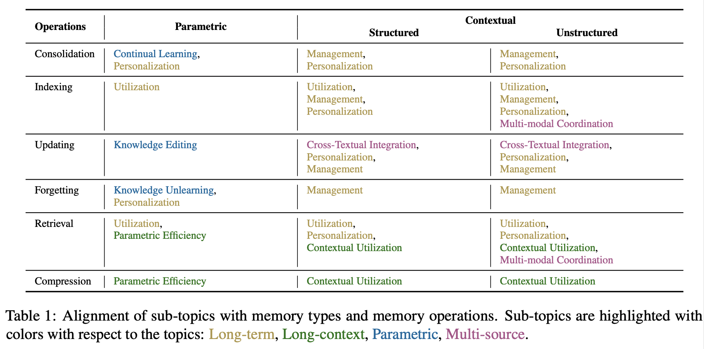

# Rethinking Memory in AI: Taxonomy, Operations, Topics, and Future Directions

<div align="center">
 <p align="center">

<a href="https://arxiv.org/abs/2505.00675">📝 Paper</a> | <a href="#1-Survey-Papers">📄 List</a> | <a href="">📚 Notions</a>

 </p>
</div>
<div align="center">


[](https://github.com/Elvin-Yiming-Du/Survey_Memory_in_AI/blob/main/LICENSE)
<!--  -->
[](https://github.com/Elvin-Yiming-Du/Survey_Memory_in_AI/commits/main)
[](https://github.com/Xnhyacinth/Long_Text_Modeling_Papers/pulls)
[](https://github.com/Elvin-Yiming-Du/Survey_Memory_in_AI)

</div>

This repository introduce a comprehensive paper list, datasets, methods and tools for memory research.

🤝🤝 Thanks for all the great contributors on GitHub!

If you find our repository and survey useful for your research, please consider citing the following paper:

```bibtex
@article{du2025rethinking,
  title={Rethinking Memory in AI: Taxonomy, Operations, Topics, and Future Directions},
  author={Du, Yiming and Huang, Wenyu and Zheng, Danna and Wang, Zhaowei and Montella, Sebastien and Lapata, Mirella and Wong, Kam-Fai and Pan, Jeff Z.},
  journal={arXiv preprint arXiv:2505.00675},
  year={2025},
  url={https://arxiv.org/abs/2505.00675}
}
```

## Contents

- [Memory in AI Papers, Dataset, Methods and Tools](#rethinking-memory-in-ai-taxonomy-operations-topics-and-future-directions)
- [📢 News](#-news)
    - [📅 Weekly Papers](#weekly-papers)
    - [🗓 Monthly Papers](#monthly-papers)
- [Memory Taxonomy](#memory-taxonomy)
- [Memory Operations](#memory-operations)
- [📜 Papers](#-papers)
    - [1. Survey Papers](#1-survey-papers)
    - [2. Memory Topics](#4-memory-topics)
        - [2.1 Long Term Memory](#21-long-term-memory)
        - [2.2 Long Context Memory](#22-long-context-memory)
        - [2.3 Parametric Memory](#23-parametric-memory)
        - [2.4 Multi-source Memory](#24-multi-source-memory)
- [📊 Datasets](#-datasets)
- [🧠 Methods](#-methods)
- [⚙️ Tools](#-tools)
- [🌞 Future Directions](#-future-directions)
- [🙏 Acknowledgements](#acknowledgements)


### Memory Taxonomy


### Memory Operations


## 📢 News

### Week Papers

## 📜 Papers

### 1. Survey Papers

1. [**A Survey on the Memory Mechanism of Large Language Model based Agents.**](https://arxiv.org/abs/2404.13501) _Zhang, Zeyu and Bo, Xiaohe and Ma, Chen and Li, Rui and Chen, Xu and Dai, Quanyu and Zhu, Jieming and Dong, Zhenhua and Wen, Ji-Rong._ Arxiv 2024.

2. [**Advancing Transformer Architecture in Long-Context Large Language Models: A Comprehensive Survey**](https://arxiv.org/abs/2311.12351) _Yunpeng Huang, Jingwei Xu, Junyu Lai, Zixu Jiang, Taolue Chen, Zenan Li, Yuan Yao, Xiaoxing Ma, Lijuan Yang, Hao Chen, Shupeng Li, Penghao Zhao._ Arxiv 2024.

3. [**Knowledge Editing for Large Language Models: A Survey**](https://arxiv.org/abs/2310.16218) _Song Wang, Yaochen Zhu, Haochen Liu, Zaiyi Zheng, Chen Chen, Jundong Li._ Arxiv 2024.

4. [**Knowledge Conflicts for LLMs: A Survey**](https://arxiv.org/abs/2403.08319) _Rongwu Xu, Zehan Qi, Zhijiang Guo, Cunxiang Wang, Hongru Wang, Yue Zhang, Wei Xu._ Arxiv 2024.

5. [**A Comprehensive Survey of Machine Unlearning Techniques for Large Language Models**](https://www.arxiv.org/abs/2503.01854) _Jiahui Geng, Qing Li, Herbert Woisetschlaeger, Zongxiong Chen, Yuxia Wang, Preslav Nakov, Hans-Arno Jacobsen, Fakhri Karray._ Arxiv 2025.

6. [**A Survey of Personalized Large Language Models: Progress and Future Directions**](https://arxiv.org/abs/2502.11528) _Jiahong Liu, Zexuan Qiu, Zhongyang Li, Quanyu Dai, Jieming Zhu, Minda Hu, Menglin Yang, Irwin King._ Arxiv 2025.

7. [**Human-inspired Perspectives: A Survey on AI Long-term Memory**](https://arxiv.org/abs/2411.00489) _Zihong He, Weizhe Lin, Hao Zheng, Fan Zhang, Matt W. Jones, Laurence Aitchison, Xuhai Xu, Miao Liu, Per Ola Kristensson, Junxiao Shen._ Arxiv 2025.

8. [**Cognitive Memory in Large Language Models**](https://arxiv.org/abs/2504.02441) _Lianlei Shan, Shixian Luo, Zezhou Zhu, Yu Yuan, Yong Wu._ Arxiv 2025.

9. [**A Comprehensive Survey on Long Context Language Modeling**](https://arxiv.org/abs/2503.17407)_Jiaheng Liu, Dawei Zhu, Zhiqi Bai, Yancheng He, Huanxuan Liao, Haoran Que, Zekun Wang, Chenchen Zhang, Ge Zhang, Jiebin Zhang, Yuanxing Zhang, Zhuo Chen, Hangyu Guo, Shilong Li, Ziqiang Liu, Yong Shan, Yifan Song, Jiayi Tian, Wenhao Wu, Zhejian Zhou, Ruijie Zhu, Junlan Feng, Yang Gao, Shizhu He, Zhoujun Li, Tianyu Liu, Fanyu Meng, Wenbo Su, Yingshui Tan, Zili Wang, Jian Yang, Wei Ye, Bo Zheng, Wangchunshu Zhou, Wenhao Huang, Sujian Li, Zhaoxiang Zhang_ Arxiv 2025.

### 2. Memory Topics

#### 2.1 Long Term Memory

1. [**Evaluating Very Long-Term Conversational Memory of LLM Agents**](https://arxiv.org/abs/2402.17753)_Adyasha Maharana, Dong-Ho Lee, Sergey Tulyakov, Mohit Bansal, Francesco Barbieri, Yuwei Fang_ Arxiv 2024.

2. [**MemoryBank: Enhancing Large Language Models with Long-Term Memory**](https://arxiv.org/abs/2305.10250)_Wanjun Zhong, Lianghong Guo, Qiqi Gao, He Ye, Yanlin Wang_ Arxiv 2024.

3. [**A-MEM: Agentic Memory for LLM Agents**](https://arxiv.org/abs/2502.12110)_Wujiang Xu, Kai Mei, Hang Gao, Juntao Tan, Zujie Liang, Yongfeng Zhang_ Arxiv 2024.

4. [**Beyond Goldfish Memory: Long-Term Open-Domain Conversation**](https://arxiv.org/abs/2107.07567) _Jing Xu, Arthur Szlam, Jason Weston._ Arxiv 2021.

5. [**Optimus-1: Hybrid Multimodal Memory Empowered Agents Excel in Long-Horizon Tasks**](https://arxiv.org/abs/2408.03615) _Zaijing Li, Yuquan Xie, Rui Shao, Gongwei Chen, Dongmei Jiang, Shizhu He._ Arxiv 2024.

6. [**HippoRAG: Neurobiologically Inspired Long-Term Memory for Large Language Models**](https://arxiv.org/abs/2405.14831) _Yu Su, Yujia Xie, Yujie Qian, Yifan Hou, Xinyan Wang, Yiming Yang, Xiang Ren._ Arxiv 2024.

7. [**Long Time No See! Open-Domain Conversation with Long-Term Persona Memory**](https://arxiv.org/abs/2203.05797) _Jing Xu, Zhengyu Niu, Wenquan Wu, Hua Wu, Haifeng Wang, Zebin Gou, Shuo Wang._ Arxiv 2022.

8. [**LongMemEval: Benchmarking Chat Assistants on Long-Term Interactive Memory**](https://arxiv.org/abs/2410.10813) _Di Wu, Hongwei Wang, Wenhao Yu, Yuwei Zhang, Kai-Wei Chang, Dong Yu._ Arxiv 2024.

9. [**"My agent understands me better": Integrating Dynamic Human-like Memory Recall and Consolidation in LLM-Based Agents**](https://arxiv.org/abs/2404.00573) _Yu Hou, Tamoto Yuta, Mayur Tikundi._ Arxiv 2024.

10. [**Keep Me Updated! Memory Management in Long-term Conversations**](https://arxiv.org/abs/2210.08750) _Sanghwan Bae, Donghyun Kwak, Soyoung Kang, Min Young Lee, Sungdong Kim, Yuin Jeong, Hyeri Kim, Sang-Woo Lee, Woomyoung Park, Nako Sung._ Arxiv 2022.

11. [**MoT: Memory-of-Thought Enables ChatGPT to Self-Improve**](https://arxiv.org/abs/2305.05181) _Sureman Lee, Yujie Qian, Yujia Xie, Yifan Hou, Xinyan Wang, Yiming Yang, Xiang Ren._ Arxiv 2023.

12. [**Recursively Summarizing Enables Long-Term Dialogue Memory in Large Language Models**](https://arxiv.org/abs/2308.15022) _Qingxue Wang, Ling Ding, Yaran Cao, Zhilang Tan, Shi Wang, Dacheng Tao, Liu Qiu._ Arxiv 2023.

13. [**Mr.Steve: Instruction-Following Agents in Minecraft with What-Where-When Memory**](https://arxiv.org/abs/2411.06736) _Yu Hou, Tamoto Yuta, Mayur Tikundi._ Arxiv 2024.

14. [**LLM-based Medical Assistant Personalization with Short- and Long-Term Memory Coordination**](https://arxiv.org/abs/2309.11696) _Yuwei Zhang, Yifan Hou, Xinyan Wang, Yiming Yang, Xiang Ren._ Arxiv 2023.

15. [**SCM: Enhancing Large Language Model with Self-Controlled Memory Framework**](https://arxiv.org/abs/2304.13343) _Bing Wang, Xinnian Liang, Jian Yang, Hui Huang, Shuangzhi Wu, Peihao Wu, Lu Lu, Zejun Ma, Zhoujun Li._ Arxiv 2023.

16. [**Towards Teachable Reasoning Systems: Using a Dynamic Memory of User Feedback for Continual System Improvement**](https://arxiv.org/abs/2204.13074) _Bhavana Dalvi Mishra, Oyvind Tafjord, Peter Clark._ Arxiv 2022.

17. [**StableSSM: Alleviating the Curse of Memory in State-space Models through Stable Reparameterization**](https://arxiv.org/abs/2311.14495) _Shida Wang, Qianxiao Li._ Arxiv 2023.

18. [**Crafting Personalized Agents through Retrieval-Augmented Generation on Editable Memory Graphs**](https://arxiv.org/abs/2409.19401) _Zheng Wang, Zhongyang Li, Zeren Jiang, Dandan Tu, Wei Shi._ Arxiv 2024.

19. [**Learning to Repair: Repairing Model Output Errors after Deployment Using a Dynamic Memory of Feedback**](https://arxiv.org/abs/2112.09737) _Niket Tandon, Aman Madaan, Peter Clark, Yiming Yang._ Arxiv 2021.

20. [**Compress to Impress: Unleashing the Potential of Compressive Memory in Real-World Long-Term Conversations**](https://arxiv.org/abs/2402.11975) _Nuo Chen, Hongguang Li, Jia Li, Yuxuan Li, Wei Wu._ Arxiv 2024.

21. [**Towards Verifiable Text Generation with Evolving Memory and Self-Reflection**](https://arxiv.org/abs/2312.09075) _Hao Sun, Hengyi Cai, Bo Wang, Yingyan Hou, Xiaochi Wei, Shuaiqiang Wang, Yan Zhang, Dawei Yin._ Arxiv 2023.

22. [**There Are a Thousand Hamlets in a Thousand People's Eyes: Enhancing Knowledge-grounded Dialogue with Personal Memory**](https://arxiv.org/abs/2204.02624) _Tingchen Fu, Xueliang Zhao, Chongyang Tao, Ji-Rong Wen, Rui Yan._ Arxiv 2022.

23. [**PerLTQA: A Personal Long-Term Memory Dataset for Memory Classification, Retrieval, and Synthesis in Question Answering**](https://arxiv.org/abs/2402.16288) _Yiming Du, Hongru Wang, Zhengyi Zhao, Bin Liang, Baojun Wang, Wanjun Zhong, Zezhong Wang, Kam-Fai Wong._ Arxiv 2024.

24. [**A Cooperative Memory Network for Personalized Task-oriented Dialogue Systems with Incomplete User Profiles**](https://arxiv.org/abs/2102.08322) _Jiahuan Pei, Pengjie Ren, Maarten de Rijke._ Arxiv 2021.

25. [**An Iterative Associative Memory Model for Empathetic Response Generation**](https://arxiv.org/abs/2402.17959) _Zhou Yang, Zhaochun Ren, Yufeng Wang, Haizhou Sun, Chao Chen, Xiaofei Zhu, Xiangwen Liao._ Arxiv 2024.

26. [**Towards Lifelong Dialogue Agents via Timeline-based Memory Management**](https://arxiv.org/abs/2406.10996) _Kai Tzu-iunn Ong, Namyoung Kim, Minju Gwak, Hyungjoo Chae, Taeyoon Kwon, Yohan Jo, Seung-won Hwang, Dongha Lee, Jinyoung Yeo._ Arxiv 2025.

27. [**COCOA: CBT-based Conversational Counseling Agent Using Memory Specialized in Cognitive Distortions and Dynamic Prompt**](https://arxiv.org/abs/2402.17546) _Suyeon Lee, Jieun Kang, Harim Kim, Kyoung-Mee Chung, Dongha Lee, Jinyoung Yeo._ Arxiv 2024.

28. [**Mixed-Session Conversation with Egocentric Memory**](https://arxiv.org/abs/2410.02503) _Jihyoung Jang, Taeyoung Kim, Hyounghun Kim._ Arxiv 2024.

29. [**FragRel: Exploiting Fragment-level Relations in the External Memory of Large Language Models**](https://arxiv.org/abs/2406.03092) _Xihang Yue, Linchao Zhu, Yi Yang._ Arxiv 2024.

30. [**LDM²: A Large Decision Model Imitating Human Cognition with Dynamic Memory Enhancement**](https://arxiv.org/abs/2312.08402) _Xingjin Wang, Linjing Li, Dongfeng Zeng._ Arxiv 2023.

31. [**NarrativeXL: A Large-scale Dataset For Long-Term Memory Models**](https://arxiv.org/abs/2305.13877) _Arseny Moskvichev, Ky-Vinh Mai._ Arxiv 2023.

32. [**Extractive Medical Entity Disambiguation with Memory Mechanism and Memorized Entity Information**](https://aclanthology.org/2024.findings-emnlp.810/) _Guobiao Zhang, Xueping Peng, Tao Shen, Guodong Long, Jiasheng Si, Libo Qin, Wenpeng Lu._ Arxiv 2024.

33. [**Zep: A Temporal Knowledge Graph Architecture for Agent Memory**](https://arxiv.org/abs/2501.13956) _Preston Rasmussen, Daniel Chalef._ Arxiv 2025.

34. [**Ever-Evolving Memory by Blending and Refining the Past**](https://arxiv.org/abs/2403.04787) _Seo Hyun Kim, Keummin Ka, Yohan Jo, Seung-won Hwang, Dongha Lee, Jinyoung Yeo._ Arxiv 2024.

35. [**Synapse: Trajectory-as-Exemplar Prompting with Memory for Computer Control**](https://arxiv.org/abs/2306.07863) _Longtao Zheng, Rundong Wang, Xinrun Wang, Bo An_ Arxiv 2024.

#### 2.2 Long Context Memory

1. [**Improved Semantic Representations From Tree-Structured Long Short-Term Memory Networks**](https://arxiv.org/abs/1503.00075) _Kai Sheng Tai, Richard Socher, Christopher D. Manning._ Arxiv 2015.

2. [**Walking Down the Memory Maze: Beyond Context Limit through Interactive Reading**](https://arxiv.org/abs/2310.05029) _Howard Chen, Ramakanth Pasunuru, Jason Weston, Asli Celikyilmaz._ Arxiv 2023.

3. [**CaM: Cache Merging for Memory-efficient LLMs Inference**](https://proceedings.mlr.press/v235/zhang24n.html) _Yuxin Zhang, Yuxuan Du, Gen Luo, Yunshan Zhong, Zhenyu Zhang, Shiwei Liu, Rongrong Ji._ Arxiv 2024.

4. [**Recurrent Memory Transformer**](https://arxiv.org/abs/2207.06881) _Aydar Bulatov, Sergey I. Nikolenko, Artem Babenko._ Arxiv 2022.

5. [**InfLLM: Training-Free Long-Context Extrapolation for LLMs with an Efficient Context Memory**](https://arxiv.org/abs/2402.04617) _Chaojun Xiao, Pengle Zhang, Xu Han, Guangxuan Xiao, Yankai Lin, Zhengyan Zhang, Zhiyuan Liu, Maosong Sun._ Arxiv 2024.

6. [**A Human-Inspired Reading Agent with Gist Memory of Very Long Contexts**](https://arxiv.org/abs/2402.09727) _Xinyun Chen, Hiroki Furuta, John Canny, Ian Tenney._ Arxiv 2024.

7. [**Synapse: Trajectory-as-Exemplar Prompting with Memory for Computer Control**](https://arxiv.org/abs/2306.07863) _Longtao Zheng, Rundong Wang, Xinrun Wang, Bo An._ Arxiv 2023.

8. [**Mastering Memory Tasks with World Models**](https://arxiv.org/abs/2403.04253) _Mohammad Reza Samsami, Artem Zholus, Janarthanan Rajendran, Sarath Chandar._ Arxiv 2024.

9. [**Memory Consolidation Enables Long-Context Video Understanding**](https://arxiv.org/abs/2402.05861) _Ivana Balazevic, Yuki M. Asano, Andreas Kirsch, Andrew Zisserman._ Arxiv 2024.

10. [**Online Adaptation of Language Models with a Memory of Amortized Contexts**](https://arxiv.org/abs/2403.04317) _Yongqiang Tack, Seonghyeon Ye, Sangwoo Mo, Jung-Woo Ha, Sung Ju Hwang._ Arxiv 2024.

11. [**InfiniPot: Infinite Context Processing on Memory-Constrained LLMs**](https://arxiv.org/abs/2410.01518) _Jungwook Choi, Yongqiang Tack, Seonghyeon Ye, Sangwoo Mo, Jung-Woo Ha, Sung Ju Hwang._ Arxiv 2024.

12. [**B'MOJO: Hybrid State Space Realizations of Foundation Models with Eidetic and Fading Memory**](https://arxiv.org/abs/2407.06324) _Luca Zancato, Arjun Seshadri, Yonatan Dukler, Aditya Golatkar, Yantao Shen, Benjamin Bowman, Matthew Trager, Alessandro Achille, Stefano Soatto._ Arxiv 2024.

13. [**Needle in the Haystack for Memory Based Large Language Models**](https://arxiv.org/abs/2407.01437) _Elliot Nelson, Georgios Kollias, Payel Das, Subhajit Chaudhury, Soham Dan._ Arxiv 2024.

14. [**Memorize Step by Step: Efficient Long-Context Prefilling with Incremental Memory and Decremental Chunk**](https://aclanthology.org/2024.emnlp-main.1169/) _Yunfan Shao, Yunlong Liang, Yongqiang Tack, Seonghyeon Ye, Sangwoo Mo, Jung-Woo Ha, Sung Ju Hwang._ Arxiv 2024.

15. [**Memory Layers at Scale**](https://arxiv.org/abs/2412.09764) _Yongqiang Tack, Seonghyeon Ye, Sangwoo Mo, Jung-Woo Ha, Sung Ju Hwang._ Arxiv 2024.

16. [**Memory Injections: Correcting Multi-Hop Reasoning Failures During Inference in Transformer-Based Language Models**](https://arxiv.org/abs/2309.05605) _Mansi Sakarvadia, Aswathy Ajith, Arham Khan, Daniel Grzenda, Nathaniel Hudson, André Bauer, Kyle Chard, Ian Foster._ Arxiv 2023.

17. [**When Compression Meets Model Compression: Memory-Efficient Double Compression for Large Language Models**](https://arxiv.org/abs/2502.15443) _Wenhao Wang, Yunhao Mao, Dingcheng Tang, Haoyu Du, Ning Guan, Yanzhi Xue._ Arxiv 2025.

18. [**MELODI: Exploring Memory Compression for Long Contexts**](https://arxiv.org/abs/2410.03156) _Yinpeng Chen, DeLesley Hutchins, Aren Jansen, Andrey Zhmoginov, David Racz, Jesper Andersen._ Arxiv 2024.

19. [**Transformer Working Memory Enables Regular Language Reasoning and Natural Language Length Extrapolation**](https://arxiv.org/abs/2305.03796) _Chi Fan, Jiaqi Mu, Yiming Yang._ Arxiv 2023.

20. [**Mini-Sequence Transformers: Optimizing Intermediate Memory for Long Sequences Training**](https://arxiv.org/abs/2407.15892) _Yongqiang Tack, Seonghyeon Ye, Sangwoo Mo, Jung-Woo Ha, Sung Ju Hwang._ Arxiv 2024.

21. [**Learn To Remember: Transformer with Recurrent Memory for Document-Level Machine Translation**](https://arxiv.org/abs/2205.01546) _Yukun Feng, Feng Li, Ziang Song, Boyuan Zheng, Philipp Koehn._ Arxiv 2022.

22. [**Linearizing Transformer with Key-Value Memory**](https://arxiv.org/abs/2203.12644) _Yizhe Zhang, Deng Cai._ Arxiv 2022.

23. [**A Memory Model for Question Answering from Streaming Data Supported by Rehearsal and Anticipation of Coreference Information**](https://arxiv.org/abs/2305.07565) _Vladimir Araujo, Andres Soto, Marie-Francine Moens._ Arxiv 2023.

24. [**LaMemo: Language Modeling with Look-Ahead Memory**](https://arxiv.org/abs/2204.07341) _Haoze Ji, Rongcheng Zhang, Zheyang Yang, Zheng Hu, Minlie Huang._ Arxiv 2022.

25. [**An Evolved Universal Transformer Memory**](https://arxiv.org/abs/2410.13166) _Edoardo Cetin, Qi Sun, Tianyu Zhao, Yujin Tang._ Arxiv 2024.

26. [**When Context Leads but Parametric Memory Follows in Large Language Models**](https://arxiv.org/abs/2409.08435) _Yufei Tao, Yujie Qian, Yiming Cui, Wanxiang Che, Ting Liu._ Arxiv 2024.


#### 2.3 Parametric Memory

1. [**Mass-Editing Memory in a Transformer**](https://arxiv.org/abs/2210.07229) _Kevin Meng, Arnab Sen Sharma, Alex Andonian, Yonatan Belinkov, David Bau._ Arxiv 2022.

2. [**Memory-Based Model Editing at Scale**](https://arxiv.org/abs/2206.06520) _Eric Mitchell, Charles Lin, Antoine Bosselut, Christopher D. Manning, Chelsea Finn._ Arxiv 2022.

3. [**Memory-assisted prompt editing to improve GPT-3 after deployment**](https://arxiv.org/abs/2201.06009) _Aman Madaan, Niket Tandon, Peter Clark, Yiming Yang._ Arxiv 2022.

4. [**Training Language Models with Memory Augmentation**](https://arxiv.org/abs/2205.12674) _Zexuan Zhong, Tao Lei, Danqi Chen._ Arxiv 2022.

5. [**Efficient Dialogue State Tracking by Selectively Overwriting Memory**](https://arxiv.org/abs/1911.03906) _Sungdong Kim, Sohee Yang, Gyuwan Kim, Donghyun Kwak, Jonghyuck Park, Jong C. Park._ Arxiv 2019.

6. [**Mass-Editing Memory with Attention in Transformers: A cross-lingual exploration of knowledge**](https://arxiv.org/abs/2502.02173) _Daniel Tamayo, Aitor Gonzalez-Agirre, Javier Gonzalez, Ander Barrena, Montse Cuadros, German Rigau._ Arxiv 2025.

7. [**DSI++: Updating Transformer Memory with New Documents**](https://arxiv.org/abs/2212.09744) _Sanket Vaibhav Mehta, Jai Gupta, Yi Tay, Mostafa Dehghani, Vinh Q. Tran, Jinfeng Rao, Marc Najork, Emma Strubell, Donald Metzler._ Arxiv 2022.

8. [**Memory3: Language Modeling with Explicit Memory**](https://arxiv.org/abs/2407.01178) _Hongkang Yang, Zehao Lin, Wenjin Wang, Hao Wu, Zhiyu Li, Bo Tang, Wenqiang Wei, Junbo Wang, Zeyun Tang, Shibao Song, Chengyang Xu, Yu Yu, Kui Chen, Feiyu Kong, Longpeng Tang, Wenhao Liu._ Arxiv 2024.

9. [**Information-theoretic Online Memory Selection for Continual Learning**](https://arxiv.org/abs/2204.04763) _Shengyang Sun, Daniele Calandriello, Huiyi Hu, Ang Li, Michalis Titsias._ Arxiv 2022.

10. [**Improving Task-free Continual Learning by Distributionally Robust Memory Evolution**](https://arxiv.org/abs/2207.07256) _Zhenyi Wang, Li Shen, Le Fang, Qiuling Suo, Tiehang Duan, Mingchen Gao._ Arxiv 2022.

11. [**A Unified Approach to Domain Incremental Learning with Memory: Theory and Algorithm**](https://arxiv.org/abs/2310.12244) _Haizhou Shi, Hao Wang._ Arxiv 2023.

12. [**Deciphering the Interplay of Parametric and Non-parametric Memory in Retrieval-augmented Language Models**](https://arxiv.org/abs/2410.05162) _Yuxiang Wu, Zihan Wang, Yiming Cui, Wanxiang Che, Ting Liu._ Arxiv 2024.

13. [**Sparse Distributed Memory is a Continual Learner**](https://arxiv.org/abs/2303.11934) _Brenton Wiernik, Xander Davies, Deepak Singh, Dmitri Krotov, Gabriel Kreiman._ Arxiv 2023.

14. [**Improving Meta-learning for Low-resource Text Classification and Generation via Memory Imitation**](https://arxiv.org/abs/2203.11670) _Yingxiu Zhao, Zhiliang Tian, Huaxiu Yao, Yinhe Zheng, Dongkyu Lee, Yiping Song, Jian Sun, Nevin L. Zhang._ Arxiv 2022.

15. [**Content Addressable Memory Without Catastrophic Forgetting by Heteroassociation with a Fixed Scaffold**](https://arxiv.org/abs/2202.00159) _Sugandha Sharma, Sarthak Chandra, Ila R. Fiete._ Arxiv 2022.

16. [**Leitner-Guided Memory Replay for Cross-lingual Continual Learning**](https://aclanthology.org/2024.naacl-long.432/) _Meryem M'hamdi, Jonathan May._ Arxiv 2024.

17. [**Navigating Memory Construction by Global Pseudo-Task Simulation for Continual Learning**](https://arxiv.org/abs/2210.08442) _Yejia Liu, Wang Zhu, Shaolei Ren._ Arxiv 2022.

18. [**Transformer as a Hippocampal Memory Consolidation Model Based on NMDAR-Inspired Nonlinearity**](https://arxiv.org/abs/2504.10886) _Jea Kwon, Jaehoon Lee, Donggyu Kim, Yongmin Park, Jongmin Choi._ Arxiv 2025.

19. [**Mechanisms of Memory Updating: State Dependency vs. Reconsolidation**](https://journalofcognition.org/articles/10.5334/joc.198) _Christopher Kiley, Colleen M. Parks._ Arxiv 2022.

20. [**Think Before You Act: Decision Transformers with Working Memory**](https://arxiv.org/abs/2305.16338) _Jikun Kang, Romain Laroche, Xingdi Yuan, Adam Trischler, Xue Liu, Jie Fu._ Arxiv 2023.

21. [**Improving Factuality with Explicit Working Memory**](https://arxiv.org/abs/2412.18069) _Mingda Chen, Yang Li, Karthik Padthe, Rulin Shao, Alicia Sun, Luke Zettlemoyer, Gargi Ghosh, Wen-tau Yih._ Arxiv 2024.

22. [**AlphaEdit: Null-Space Constrained Knowledge Editing for Language Models**](https://arxiv.org/abs/2410.02355) _Junfeng Fang, Houcheng Jiang, Kun Wang, Yunshan Ma, Shi Jie, Xiang Wang, Xiangnan He, Tat-seng Chua_ Arxiv 2025.

23. [**Locating and Editing Factual Associations in GPT**](https://arxiv.org/abs/2202.05262) _Kevin Meng, David Bau, Alex Andonian, Yonatan Belinkov_ Arxiv 2023.

24. [**WISE: Rethinking the Knowledge Memory for Lifelong Model Editing of Large Language Models**](https://arxiv.org/abs/2405.14768) _Peng Wang, Zexi Li, Ningyu Zhang, Ziwen Xu, Yunzhi Yao, Yong Jiang, Pengjun Xie, Fei Huang, Huajun Chen_ Arxiv 2024.

25. [**Can We Edit Factual Knowledge by In-Context Learning?**](https://arxiv.org/abs/2305.12740) _Ce Zheng, Lei Li, Qingxiu Dong, Yuxuan Fan, Zhiyong Wu, Jingjing Xu, Baobao Chang_ Arxiv 2023.

26. [**Memory Replay with Data Compression for Continual Learning**](https://arxiv.org/abs/2202.06592) _Liyuan Wang, Xingxing Zhang, Kuo Yang, Longhui Yu, Chongxuan Li, Lanqing Hong, Shifeng Zhang, Zhenguo Li, Yi Zhong, Jun Zhu_ Arxiv 2022.

27. [**MEMORYLLM: Towards Self-Updatable Large Language Models**](https://arxiv.org/abs/2402.04624) _Yu Wang, Yifan Gao, Xiusi Chen, Haoming Jiang, Shiyang Li, Jingfeng Yang, Qingyu Yin, Zheng Li, Xian Li, Bing Yin, Jingbo Shang, Julian McAuley_ Arxiv 2024.


#### 2.4 Multi-source Memory

1. [**ChatDB: Augmenting LLMs with Databases as Their Symbolic Memory**](https://arxiv.org/abs/2306.03901) _Chenxu Hu, Jie Yu, Chencheng Dong, Junbo Zhao, Hang Zhao._ Arxiv 2023.

2. [**DelTA: An Online Document-Level Translation Agent Based on Multi-Level Memory**](https://arxiv.org/abs/2410.08143) _Yutong Wang, Jiali Zeng, Xuebo Liu, Derek F. Wong, Fandong Meng, Jie Zhou, Min Zhang._ Arxiv 2024.

3. [**An Efficient Memory-Augmented Transformer for Knowledge-Intensive NLP Tasks**](https://arxiv.org/abs/2210.16773) _Yuxiang Wu, Yu Zhao, Baotian Hu, Pasquale Minervini, Pontus Stenetorp, Sebastian Riedel._ Arxiv 2022.

4. [**Open-Ended Instructable Embodied Agents with Memory-Augmented Large Language Models**](https://arxiv.org/abs/2310.15127) _Gabriel Sarch, Yuxiang Wu, Yuqi Xie, Yunfan Jiang, Linxi Fan, Ajay M. Patel, Yuke Zhu, Anima Anandkumar._ Arxiv 2023.

5. [**Symbolic Working Memory Enhances Language Models for Complex Rule Application**](https://arxiv.org/abs/2408.13654) _Yuxiang Wang, Jingwei Wei, Yicheng Wang, Zheng Zhang, Yuan-Fang Li._ Arxiv 2024.

6. [**There Are a Thousand Hamlets in a Thousand People's Eyes: Enhancing Knowledge-grounded Dialogue with Personal Memory**](https://arxiv.org/abs/2204.02624) _Tingchen Fu, Xueliang Zhao, Chongyang Tao, Ji-Rong Wen, Rui Yan._ Arxiv 2022.

7. [**Prior Knowledge and Memory Enriched Transformer for Sign Language Translation**](https://aclanthology.org/2022.findings-acl.297/) _Tao Jin, Zhou Zhao, Meng Zhang, Xingshan Zeng._ Arxiv 2022.

8. [**G-MAP: General Memory-Augmented Pre-trained Language Model for Domain Tasks**](https://arxiv.org/abs/2212.03613) _Yuxiang Wu, Yu Zhao, Baotian Hu, Pasquale Minervini, Pontus Stenetorp, Sebastian Riedel._ Arxiv 2022.

9. [**Memory Augmented Language Models through Mixture of Word Experts**](https://arxiv.org/abs/2311.10768) _Cicero Nogueira dos Santos, James Lee-Thorp, Isaac Noble, Chung-Ching Chang, David Uthus._ Arxiv 2023.

10. [**A Cooperative Memory Network for Personalized Task-oriented Dialogue Systems with Incomplete User Profiles**](https://arxiv.org/abs/2102.08322) _Jiahuan Pei, Pengjie Ren, Maarten de Rijke._ Arxiv 2021.

11. [**Memory-aligned Knowledge Graph for Clinically Accurate Radiology Image Report Generation**](https://aclanthology.org/2022.bionlp-1.11/) _Sixing Yan._ Arxiv 2022.

12. [**MATTER: Memory-Augmented Transformer Using Heterogeneous Knowledge Sources**](https://arxiv.org/abs/2406.04670) _Yuxiang Wu, Yu Zhao, Baotian Hu, Pasquale Minervini, Pontus Stenetorp, Sebastian Riedel._ Arxiv 2024.

13. [**A Framework for Inference Inspired by Human Memory Mechanisms**](https://arxiv.org/abs/2310.09297) _Yuxiang Wu, Yu Zhao, Baotian Hu, Pasquale Minervini, Pontus Stenetorp, Sebastian Riedel._ Arxiv 2023.

14. [**M3: 3D-Spatial MultiModal Memory**](https://arxiv.org/abs/2503.16413) _Yuxiang Wu, Yu Zhao, Baotian Hu, Pasquale Minervini, Pontus Stenetorp, Sebastian Riedel._ Arxiv 2025.

15. [**Learning Multimodal Contrast with Cross-modal Memory and Reinforced Contrast Recognition**](https://arxiv.org/abs/2404.00925) _Yuanhe Tian, Fei Xia, Yan Song._ Arxiv 2024.

16. [**Stable Hadamard Memory: Revitalizing Memory-Augmented Agents for Reinforcement Learning**](https://arxiv.org/abs/2401.08523) _Yuxiang Wu, Yu Zhao, Baotian Hu, Pasquale Minervini, Pontus Stenetorp, Sebastian Riedel._ Arxiv 2024.

## 📊 Datasets

### Evaluation for Long Term Memroy.

<p align="center"><strong>Table-1: Datasets for Evaluating Long-Term Memory *(Continuously Updated)</strong></p>

| **Dataset** | **Mo** | **Operations** | **DS Type** | **Per** | **TR** | **Metrics** | **Purpose** | **Year** |
|-------------|--------|----------------|-------------|---------|--------|-------------|-------------|----------|
| [**LongMemEval**](https://github.com/xiaowu0162/LongMemEval) | text | Indexing, Retrieval, Compression | MS | ✗ | ✓ | Recall@K, NDCG@K, Accuracy | Benchmark chat assistants on long-term memory abilities, including temporal reasoning. | 2025 |
| [**LoCoMo**](https://snap-research.github.io/locomo) | text + image | Indexing, Retrieval, Compression | MS | ✗ | ✓ | Accuracy, ROUGE, Precision, Recall, F1 | Evaluate long-term memory in LLMs across QA, event summarization, and multimodal dialogue tasks. | 2024 |
| [**MemoryBank**](https://github.com/zhongwanjun/MemoryBank-SiliconFriend/tree/main) | text | Updating, Retrieval | MS | ✓ | ✗ | Accuracy, Human Eval | Enhance LLMs with long-term memory capabilities, adapting to user personalities and contexts. | 2024 |
| [**PerLTQA**](https://github.com/Elvin-Yiming-Du/PerLTQA) | text | Retrieval | MS | ✓ | ✗ | MAP, Recall, Precision, F1, Accuracy, GPT4 score | To explore personal long-term memory question answering ability. | 2024 |
| [**MALP**](https://github.com/MatthewKKai/MaLP) | text | Retrieval, Compression | QA | ✓ | ✗ | ROUGE, Accuracy, Win Rate | Preference-conditioned dialogue generation. Parameter-efficient fine-tuning (PEFT) for customization. | 2024 |
| [**DialSim**](https://dialsim.github.io/) | text | Retrieval | MS | ✓ | ✗ | Accuracy | To evaluate dialogue systems under realistic, real-time, and long-context multi-party conversation conditions. | 2024 |
| [**CC**](https://conversation-chronicles.github.io/) | text | Retrieval | MS | ✗ | ✓ | BLEU, ROUGE | For long-term dialogue modeling with time and relationship context. | 2023 |
| [**LAMP**](https://lamp-benchmark.github.io/) | text | Consolidation, Retrieval, Compression | MS | ✓ | ✓ | Accuracy, F1, ROUGE | Multiple entries per user. Supports both user-based splits and time-based splits. | 2023 |
| [**MSC**](https://parl.ai/projects/msc/) | text | Consolidation, Retrieval, Compression | MS | ✓ | ✗ | PPL | Evaluate and improve long-term dialogue models via multi-session chats with evolving knowledge. | 2022 |
| [**DuLeMon**](https://github.com/PaddlePaddle/Research/tree/master/NLP/ACL2022-DuLeMon) | text | Consolidation, Updating, Retrieval, Compression | MS | ✓ | ✗ | Accuracy, F1, Recall, Precision, PPL, BLEU, DISTINCT | For dynamic persona tracking and consistent long-term interaction. | 2022 |
| [**2WikiMultiHopQA**](https://github.com/Alab-NII/2wikimultihop) | table + knowledge base + text | Consolidation, Indexing, Retrieval, Compression | QA | ✗ | ✗ | EM, F1 | Multi-hop QA combining structured and unstructured data with reasoning paths. | 2020 |
| [**NQ**](https://github.com/google-research-datasets/natural-questions) | text | Retrieval, Compression | QA | ✗ | ✗ | EM, F1 | Open-domain QA based on real Google search queries. | 2019 |
| [**HotpotQA**](https://hotpotqa.github.io/) | text | Retrieval, Compression | QA | ✗ | ✗ | EM, F1 | Multi-hop QA with explainable reasoning and sentence-level supporting facts. | 2018 |

---

**Note:**  
- **Mo**: Modality of the dataset (e.g., text, image, table).  
- **Ops** (*Operations*): Memory-related operations supported or evaluated (e.g., Indexing, Retrieval, Compression, Updating, Consolidation).  
- **DS Type**: Dataset type —  
  - **QA** = Question Answering  
  - **MS** = Multi-Session Dialogue  
- **Per**: Persona present (✓ = Yes, ✗ = No).  
- **TR**: Temporal reasoning required or present (✓ = Yes, ✗ = No).

### Evaluation for Long Context Memory

<p align="center"><strong>Table-2: Datasets for Long-Context Memory Evaluation *(Continuously Updated)*</strong></p>

| **Dataset** | **Modality** | **Operations** | **Metrics** | **Purpose** | **Year** |
|-------------|--------------|----------------|-------------|-------------|----------|
| [**WikiText-103**](https://huggingface.co/datasets/Salesforce/wikitext) | text | compression | PPL | 100M-token Wikipedia corpus for long-context language modeling | 2016 |
| [**PG-19**](https://github.com/google-deepmind/pg19) | text | compression | PPL | Project Gutenberg books corpus for long-context language modeling | 2019 |
| [**LRA**](https://github.com/google-research/long-range-arena) | text + image | compression, retrieval | Acc | Benchmark with 6 tasks for evaluating efficient long-context language models | 2020 |
| [**NarrativeQA**](https://github.com/google-deepmind/narrativeqa) | text | retrieval | Bleu-1, Bleu-4, Meteor, Rouge-L, MRR | QA dataset for evaluating long-context QA ability | 2017 |
| [**TriviaQA**](https://nlp.cs.washington.edu/triviaqa/) | text | retrieval | EM, F1 | QA dataset for evaluating long-context QA ability | 2017 |
| [**NaturalQuestions**](https://github.com/google-research-datasets/natural-questions) | text | retrieval | EM, F1 | QA dataset for evaluating long-context QA ability | 2019 |
| [**MusiQue**](https://github.com/StonyBrookNLP/musique) | text | retrieval | F1 | Multi-hop QA dataset for evaluating long-context reasoning and QA | 2021 |
| [**CNN/DailyMail**](https://github.com/abisee/cnn-dailymail) | text | compression | Rouge-1, Rouge-2, Rouge-L | News articles dataset for long document summarization | 2016 |
| [**GovReport**](https://gov-report-data.github.io/) | text | compression | Rouge-1, Rouge-2, Rouge-L, Bert Score | Government agency reports for long document summarization | 2021 |
| [**L-Eval**](https://github.com/OpenLMLab/LEval) | text | compression, retrieval | Rouge-L, F1, GPT4 | 20-subtask benchmark for diverse long-context language model evaluation | 2023 |
| [**LongBench**](https://github.com/THUDM/LongBench/tree/main/LongBench) | text | compression, retrieval | F1, Rouge-L, Accuracy, EM, Edit Sim | 14 English, 5 Chinese, 2 code tasks for long-context evaluation | 2023 |
| [**LongBench v2**](https://github.com/THUDM/LongBench/) | text + table + KG | compression, retrieval | Acc | Longer, more challenging tasks with consistent multi-choice format | 2024 |


### Paramatric Memory Modification

<p align="center"><strong>Table-3: Datasets for Parametric Memory Evaluation *(Continuously Updated)*</strong></p>


| **Dataset** | **Modality** | **Operations** | **Metrics** | **Purpose** | **Year** |
|-------------|--------------|----------------|-------------|-------------|----------|
| [**KnowEdit**](https://huggingface.co/datasets/zjunlp/KnowEdit) | text | updating | Edit Success, Portability, Locality, Fluency | 6 datasets covering insertion, modification, and erasure | 2024 |
| [**MQUAKE-CF**](https://github.com/princeton-nlp/MQuAKE/tree/main/datasets) | text | updating | Edit-wise Success Rate, Instance-wise Accuracy, Multi-hop Accuracy | Counterfactual knowledge editing through multi-hop reasoning (up to 4 hops) | 2023 |
| [**MQUAKE-T**](https://github.com/princeton-nlp/MQuAKE/tree/main/datasets) | text | updating | Edit-wise Success Rate, Instance-wise Accuracy, Multi-hop Accuracy | Temporal knowledge editing with one edit per reasoning chain | 2023 |
| [**Counterfact**](https://rome.baulab.info/data/dsets/counterfact.json) | text | updating | Efficacy Score, Magnitude, Paraphrase & Neighborhood Scores | Tests substantial factual changes beyond superficial edits | 2022 |
| [**zsRE**](https://mega.nz/folder/p9JC3bwC#vzcrsh9b-pnWPaWdlcBVUA) | text | updating | Success Rate, Retain Accuracy, Equivalence Accuracy, Perf. Deterioration | One of the earliest datasets for knowledge editing | 2021 |
| [**MUSE**](https://muse-bench.github.io/) | text | forgetting | VerbMem, KnowMem, PrivLeak | Unlearning benchmark with 6 desirable properties | 2024 |
| [**KnowUnDo**](https://github.com/zjunlp/KnowUnDo) | text | forgetting | Unlearn Success, Retention Success, Perplexity, ROUGE-L | Test unlearning in copyrighted and privacy-sensitive domains | 2024 |
| [**RWKU**](https://rwku-bench.github.io/) | text | forgetting | ROUGE-L | Real-world unlearning under corpus-free, adversarial settings | 2024 |
| [**WMDP**](https://www.wmdp.ai/) | text | forgetting | QA accuracy | Proxy for hazardous knowledge in bio/cyber/chemical domains | 2024 |
| [**TOFU**](https://locuslab.github.io/tofu/) | text | forgetting | Probability, ROUGE, Truth Ratio | Unlearning dataset of facts about 200 fictitious authors | 2024 |
| [**ABSA**](https://github.com/yangheng95/ABSADatasets) | text | consolidation | F1 | Aspect-based sentiment analysis for continual learning | 2024 |
| [**SGD**](https://github.com/google-research-datasets/dstc8-schema-guided-dialogue) | text | consolidation | JGA, FWT, BWT | Multi-turn task-oriented dialogue with evolving intents | 2020 |
| [**INSPIRED**](https://github.com/google-research-datasets/dstc8-schema-guided-dialogue) | text | consolidation | JGA, FWT, BWT | Task-oriented dialogue supporting user goal evolution | 2020 |
| [**Natural Question**](https://ai.google.com/research/NaturalQuestions) | text | consolidation | Indexing Accuracy, Hits@1 | Supports continual learning over evolving document corpora | 2019 |

---

**Note:**  
- This table covers datasets for evaluating **parametric memory** in LLMs.  
- **Operations**:  
  - *updating* – assessing model behavior after direct memory modification  
  - *forgetting* – evaluating unlearning/removal of specific knowledge  
  - *consolidation* – integrating new knowledge without harming prior capabilities  
- **Metrics** include fluency, factuality, locality, transfer, edit effectiveness, and forgetting accuracy.

### Evaluation for Multi-Source Memory

<p align="center"><strong>Table-4: Datasets for Multi-Source Memory Evaluation *(Continuously Updated)*</strong></p>


| **Dataset** | **Mo** | **Ops** | **Src#** | **Mod#** | **Task** | **Metrics** | **Purpose** | **Year** |
|-------------|--------|---------|----------|----------|----------|-------------|-------------|----------|
| [**MultiChat**](https://github.com/Vincy2King/IGSR) | text + image | Retrieval | 2 | 2 | Retrieval | Precision, mAP, GPT-4 | Image-grounded sticker retrieval with cross-session image-text dialogue context. | 2025 |
| [**Context-conflicting**](https://github.com/Tan-Hexiang/RetrieveOrGenerated) | text | Compression | 2 | 1 | Conflict | DiffGR, EM, Similarity | Evaluates model handling of conflicting evidence across sources. | 2024 |
| [**EgoSchema**](https://egoschema.github.io) | video + text | Retrieval, Compression | 3 | 2 | Fusion | Accuracy | Episodic video + social schema + conversation for long-term memory QA. | 2023 |
| [**Ego4D NLQ**](https://ego4d-data.org) | video + text | Retrieval, Compression | 2 | 2 | Fusion | Recall@K | Natural language queries over egocentric video with temporal memory. | 2022 |
| [**2WikiMultihopQA**](https://github.com/Alab-NII/2wikimultihop) | text | Indexing, Retrieval, Compression | 2 | 1 | Reasoning | EM, F1 | Multi-hop QA across Wikipedia passages with sentence-level support. | 2020 |
| [**HybridQA**](https://hybridqa.github.io/) | text | Retrieval, Compression | 2 | 1 | Reasoning | EM, F1 | Reasoning across structured tables and unstructured text. | 2020 |
| [**CommonsenseVQA**](https://huggingface.co/datasets/tau/commonsense_qa) | text + image | Retrieval, Compression | 2 | 2 | Fusion | Accuracy | Commonsense QA over visual scenes requiring visual-textual fusion. | 2019 |
| [**NaturalQuestions**](https://ai.google.com/research/NaturalQuestions) | text | Retrieval, Compression | >1* | 1 | Conflict | EM, F1 | QA over Google snippets; used for contradiction analysis. | 2019 |
| [**ComplexWebQuestions**](https://huggingface.co/datasets/drt/complex_web_questions) | text | Retrieval, Compression | >1* | 1 | Reasoning | EM, F1 | Compositional QA requiring multi-step reasoning over web snippets. | 2018 |
| [**HotpotQA**](https://hotpotqa.github.io/) | text | Retrieval, Compression | 2 | 1 | Conflict | EM, F1, Supporting Fact Accuracy | Multi-hop QA with paragraph- and sentence-level support. | 2018 |
| [**TriviaQA**](http://nlp.cs.washington.edu/triviaqa/) | text | Retrieval, Compression | ≥6 | 1 | Conflict | EM, F1 | QA with noisy web sources; useful for source disagreement analysis. | 2017 |
| [**WebQuestionsSP**](https://aka.ms/WebQuestionsSP) | text | Indexing, Retrieval, Compression | >1* | 1 | Reasoning | F1, Accuracy | Structured QA dataset with enhanced reasoning chains. | 2016 |
| [**Flickr30K**](https://shannon.cs.illinois.edu/DenotationGraph/) | text + image | Retrieval, Compression | 2 | 2 | Retrieval | Similarity | Image-caption pairs for cross-modal retrieval and alignment. | 2014 |

---

**Note:**  
- **Mo**: Modality (e.g., text, image, video).  
- **Ops**: Operations (e.g., Retrieval, Compression, Indexing).  
- **Src#**: Number of sources per instance.  
- **Mod#**: Number of modalities involved.  
- **Task**:  
  - *Retrieval*: retrieving relevant knowledge  
  - *Fusion*: integrating multiple modalities  
  - *Reasoning*: multi-hop or logic-based inference  
  - *Conflict*: handling conflicting sources


## 🧠 Methods
- Overview and comparison of methods used in AI memory research.

## ⚙️ Tools

### Components Level
<p align="center"><strong>Table-1: Component-Level Tools for Memory Management and Utilization. *(Continuously Updated)*</strong></p>

| **Memory Tool** | **Function** | **Input/Output** | **Example Use** |
|-----------------|--------------|------------------|------------------|
| [**FAISS**](https://github.com/facebookresearch/faiss) | Library for fast storage, indexing, and retrieval of high-dimensional vectors | Vector / Index, relevance score | Indexing large sets of text embeddings and retrieving relevant documents in RAG systems | Open Source |
| [**Neo4j**](https://neo4j.com/?utm_source=chatgpt.com) | Native graph database supporting ACID transactions and Cypher query language | Nodes and relationships with properties / Query results via Cypher | Modeling and retrieving complex relational data for use cases like fraud detection and recommendation engines | Conditional Open Source |
| [**Chroma**](https://github.com/chroma-core/chroma) | AI-native embedding database for building LLM applications | Text / Embeddings | Managing knowledge, facts, and skills for LLMs | Open Source |
| [**Milvus**](https://github.com/milvus-io/milvus) | Vector database for embedding similarity search and AI applications | Embeddings / Similar items | Unstructured data search and similarity matching | Open Source |
| [**Qdrant**](https://github.com/qdrant/qdrant) | Vector similarity search engine and database | Embeddings / Similar items | Production-ready service with user-friendly API for vector search | Open Source |
| [**Weaviate**](https://github.com/semi-technologies/weaviate) | Open-source vector database with built-in ML models | Data objects and vector embeddings / Search results | Scalable storage and retrieval for AI applications | Open Source |
| [**BM25**](https://pypi.org/project/rank-bm25/) | Probabilistic ranking function for estimating document relevance | Text queries / Ranked list of documents | Enhancing search engine results and document retrieval systems | Open Source |
| [**Contriever**](https://github.com/facebookresearch/contriever) | Unsupervised dense retriever trained with contrastive learning | Query text / List of similar documents | High-recall retrieval tasks in multilingual question-answering systems | Open Source |
| [**Embedding Models (e.g., OpenAI)**](https://huggingface.co/spaces/mteb/leaderboard) | Convert text, images, or audio into dense vector representations capturing semantic meaning | Raw data / Vector embeddings | Text similarity computation, recommendation systems, and clustering tasks | Open Source |

### Framework Level

<p align="center"><strong>Table-2: Framework-Level Tools for Memory Management and Utilization *(Continuously Updated)*</strong></p>

| **Memory Tool** | **Function** | **Input/Output** | **Example Use** | **Source Type** |
|-----------------|--------------|------------------|------------------|-----------------|
| [**Graphiti**](https://github.com/getzep/graphiti) | Framework for building and querying temporally-aware knowledge graphs tailored for AI agents in dynamic environments | Multi-source data / Queryable knowledge graph | Constructing real-time knowledge graphs to enhance AI agent memory | Open |
| [**LlamaIndex**](https://www.llamaindex.ai/) | A flexible framework for building knowledge assistants using LLMs connected to enterprise data | Text / Context-augmented responses | Developing knowledge assistants that process complex data formats | Open |
| [**LangChain**](https://www.langchain.com/) | Provides a framework for building context-aware, reasoning applications by connecting LLMs with external data sources | Input prompts / Multi-step reasoning outputs | Creating complex LLM applications like question-answering systems and chatbots | Open |
| [**LangGraph**](https://github.com/langchain-ai/langgraph) | Constructs controllable agent architectures supporting long-term memory and human-in-the-loop multi-agent systems | Graph state / State updates | Building complex task workflows with multiple AI agents | Open |
| [**EasyEdit**](https://github.com/zjunlp/EasyEdit) | An easy-to-use knowledge editing framework for LLMs, enabling efficient behavior modification within specific domains | Edit instructions / Updated model behavior | Modifying LLM knowledge in specific domains, such as updating factual information | Open |
| [**CrewAI**](https://www.crewai.com/) | A platform for building and deploying multi-agent systems, supporting automated workflows using any LLM and cloud platform | Multi-agent tasks / Collaborative results | Automating workflows across agents like project management and content generation | Open |
| [**Letta**](https://www.letta.com/) | Constructs stateful agents with long-term memory, advanced reasoning, and custom tools within a visual environment | User interactions / Improved response | Developing AI agents that learn and improve over time | Open |

### Application-Layer Level

<p align="center"><strong>Table-3: Application Layer-Level Tools for Memory Management and Utilization (Continuously Updated)</strong></p>

| **Memory Tool** | **Function** | **Input/Output** | **Example Use** | **Source Type** |
|-----------------|--------------|------------------|------------------|-----------------|
| [**Mem0**](https://mem0.ai/) | Provides a smart memory layer for LLMs, enabling direct addition, updating, and searching of memories in models | User interactions / Personalized responses | Enhancing AI systems with persistent context for customer support and personalized recommendations | Open |
| [**Zep**](https://www.getzep.com/) | Integrates chat messages into a knowledge graph, offering accurate and relevant user information | Chat logs, business data / Knowledge graph query results | Augmenting AI agents with knowledge through continuous learning from user interactions | Open |
| [**Memary**](https://github.com/kingjulio8238/Memary) | An open memory layer that emulates human memory to help AI agents manage and utilize information effectively | Agent tasks / Memory management and utilization | Building AI agents with human-like memory characteristics | Open |
| [**Memobase**](https://www.memobase.io/) | A user profile-based long-term memory system designed to provide personalized experiences in generative AI applications | User interactions / Personalized responses | Implementing virtual assistants, educational tools, and personalized AI companions | Open |

### Product Level

<p align="center"><strong>Table-4: Product-Level Tools for Memory Utilization (Continuously Updated)</strong></p>

| **Memory Tool** | **Function** | **Input/Output** | **Example Use** | **Source Type** |
|-----------------|--------------|------------------|------------------|-----------------|
| [**Me.bot**](https://www.me.bot/) | AI-powered personal assistant that organizes notes, tasks, and memories, providing emotional support and productivity tools | User inputs (text, voice) / Organized notes, reminders, summaries | Personal productivity enhancement, emotional support, idea organization | Closed |
| [**ima.copilot**](https://ima.qq.com/) | Intelligent workstation powered by Tencent's Mix Huang model, building a personal knowledge base for learning and work scenarios | User queries / Customized responses, knowledge retrieval | Enhancing learning efficiency, work productivity, knowledge management | Closed |
| [**Coze**](https://www.coze.com/) | Enables multi-agent collaboration across various platforms | User-defined workflows / Response | Deployed chatbots, AI agents | Closed |
| [**Grok**](https://x.ai/grok) | AI assistant developed by xAI, designed to provide truthful, useful, and curious responses, with real-time data access and image generation | Query / Informative answers, generated images | Answering questions, generating images, providing insights | Closed |
| [**ChatGPT**](https://chat.openai.com/) | Conversational AI developed by OpenAI, capable of understanding and generating human-like text based on prompts | User prompts / Generated text responses | Answering questions, generating images, providing insights | Closed |

## 🌞 Future Directions

## Acknowledgements

Please contact me if I miss your names in the list, I will add you back ASAP!

### Contributors

<a href="https://github.com/Elvin-Yiming-Du/Survey_Memory_in_AI/graphs/contributors">
  
</a>

### Star History

[](https://github.com/Elvin-Yiming-Du/Survey_Memory_in_AI/stargazers)


